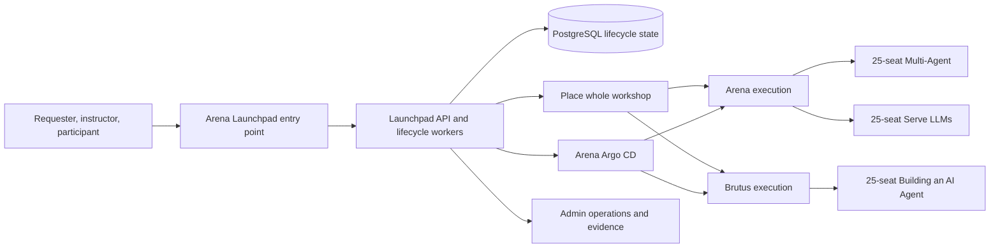
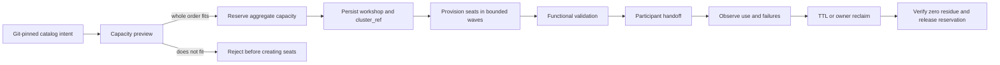
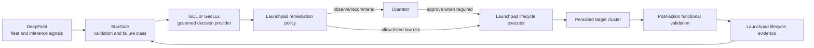

# Launchpad ecosystem architecture and scale roadmap

## Purpose and release boundary

Launchpad is the distributed control plane for ordering, placing, provisioning,
validating, using, observing, and reclaiming Intel and Red Hat lab experiences.
Git holds catalog, Showroom, deployment, certification, and operational
contracts. A workshop is one order with isolated participant seats; every seat
in an order stays on one execution cluster.

The current release is a **supervised internal pilot**, not a production or GA
service. The automated September 17 topology is GREEN-live: three staggered
25-seat workshops were created, all 75 participant environments ran together,
and all resources were reclaimed with zero residue. Manual visual acceptance,
stable public ingress, the Keycloak upgrade, and live per-seat LiteLLM
attribution remain separate gates.

## Certified current topology

| Capability | Current state | Boundary |
|---|---|---|
| Arena control plane | Active | API, database, requester/admin surfaces, lifecycle workers, Keycloak, and Argo CD |
| Arena execution | Certified for the two named 25-seat event workshops | The two orders are staggered; capacity is not a promise for arbitrary catalogs |
| Brutus execution | Certified for the 25-seat Building an AI Agent workshop | Internal access only; placement uses the persisted remote client |
| Oberon execution | Excluded | KubeVirt/HCO and namespace deletion must be remediated and recertified |
| Flightpath | Passive DR candidate | No active writer; promotion requires Arena fencing, restore, and a drill |
| Public participant access | Feature-gated pilot | Temporary tunnel work is not stable production ingress |
| Model attribution | Contract GREEN-local | Arena participant inference still uses direct OVMS/vLLM endpoints; live per-seat LiteLLM metrics are unavailable |

## Order-to-reclaim lifecycle

The persisted `cluster_ref` is the lifecycle boundary. Create, validation,
retry, expiry, reclaim, and orphan reconciliation must always address that
cluster. Launchpad must never migrate an active seat, retry cleanup against a
different cluster, or split a workshop silently.

## Distributed execution contract

An execution cluster is eligible only when all required facts are known and
healthy:

- explicit API, ingress, Console, storage class, capabilities, and model routes;
- a dedicated least-privilege Launchpad credential stored outside Git;
- a separate Argo CD destination credential;
- durable, immutable images reachable from that cluster;
- sufficient measured CPU, memory, pod, storage, and node headroom;
- required Operators, model endpoints, route/WebSocket behavior, and cleanup;
- a successful 1 -> 5 -> 25 certification for each catalog/cluster pairing.

Missing credentials, health, capacity, or capabilities make the target
ineligible. A theoretical allocatable total is never a published seat limit.

## Scale roadmap

| Stage | Objective | Required proof | Status |
|---|---|---|---|
| Pilot baseline | Three staggered 25-seat orders; 75 environments active together | 75/75 journeys, isolation, soak, bulk reclaim, zero residue | GREEN-live automated; manual visual gate pending |
| Repeatable event | Re-run exact topology on demand | Three consecutive current-version runs, readiness percentiles, support rehearsal | Next operational gate |
| More catalogs | Add a quickstart repo without bespoke platform edits | Discovery, intake, source build, 1/5/25 proof contract | Scaffold introduced; adoption per catalog |
| More clusters | Register another CPU execution cluster | Least privilege, images, ingress, model routes, 1/5/25 gates | Playbook path defined |
| Larger workshops | 50 then 75 seats on one cluster | Measured headroom, node stability, functional load, reclaim | Do not advertise yet |
| Multi-event fleet | Concurrent orders across three or more targets | Queue fairness, capacity reservations, SLOs, failure-domain tests | Roadmap |
| Production service | Stable public ingress, HA/DR, security, support, ownership | Complete production rubric and drills | Post-pilot |

Provisioning performance should be improved through durable queues, bounded
seat waves, pre-seeded images, shared services, and measured cluster/catalog
percentiles. Shared services reduce duplicated pod cost only when namespace
isolation, availability, versioning, and ownership remain explicit. Per-seat
components should not be shared solely to make a capacity preview pass.

## Operations intelligence and auto-remediation

The proposed integrations are shared control-plane services, not a bundle
copied into every participant namespace.

| System | Intended role | Current maturity |
|---|---|---|
| Launchpad | Lifecycle authority, ownership, policy enforcement, execution, audit | Active pilot |
| StarGate | Preflight constraints, readiness evidence, failure classification, remediation callback contract | Adapter/contracts exist; production autonomy not certified |
| DeepField | Fleet, network, and inference signals for placement and incident context | Adapter exists; participant access and TLS hardening remain gated |
| GCL or GeoLux | Governed hypothesis/decision provider operating on bounded evidence | Selection and contract spike pending; neither is an execution authority |

GCL and GeoLux should first implement the same versioned decision-provider
contract: evidence references in, proposed action, confidence, constraints,
risk, explanation, and expiry out. Choose one after a contract spike measuring
fit, operability, security boundary, latency, and ownership. Deploying both
before that decision adds complexity without improving the pilot.

Remediation graduates one failure class at a time:

1. **Observe:** attach evidence; an operator follows the runbook.
2. **Recommend:** propose one bounded action and show affected resources.
3. **Approve:** an authenticated operator authorizes an idempotent execution.
4. **Automatic:** allow-list a low-risk action with retry budget, circuit breaker,
   post-validation, and escalation.

First candidates are delayed validation retry, owned Showroom resync, generated
Route reconciliation, bounded managed-workload restart, expired-session
reclaim, and stale-record repair. RBAC, Secrets, cluster-scoped Operators,
storage deletion, node repair, shared models, DNS/certificates, and cross-cluster
migration always require human authority.

## Source-of-truth map

| Concern | Repository contract |
|---|---|
| Cluster registry | `config/clusters.yaml` |
| Control-plane deployment | `deploy/launchpad/overlays/arena` and HA pilot overlay |
| Remote registration | `deploy/multicluster/` |
| Portable orchestration | `deploy/ecosystem/` |
| Catalog intake | `catalog-onboarding/<catalog-id>.yaml` |
| Catalog record | `catalog/<catalog-id>/catalog-item.yaml` |
| Learner journey | `content*/` Antora/AsciiDoc |
| Deterministic proof | `certification/catalog/` and `scripts/catalog_certification.py` |
| Immutable run evidence | `evidence/` and `evidence/runs/` |
| Support and recovery | `docs/support-runbook.md` and cluster-specific runbooks |

## Architecture decisions still open

- GCL versus GeoLux as the governed decision provider;
- durable public DNS, certificate, and ingress ownership;
- live per-seat LiteLLM routing and attribution;
- Flightpath promotion/failback rehearsal and recovery objectives;
- third execution cluster and larger single-cluster workshop limits;
- service ownership and support rotations for a production deployment.
