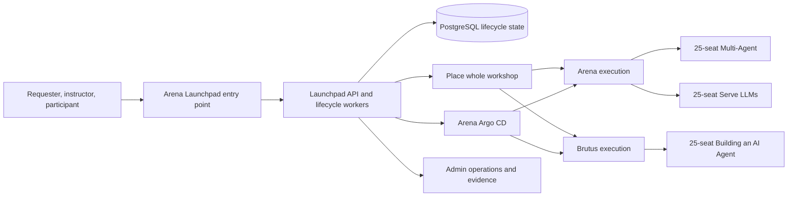
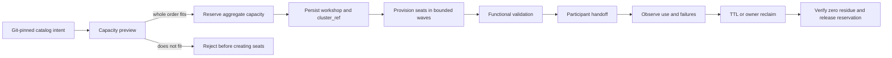
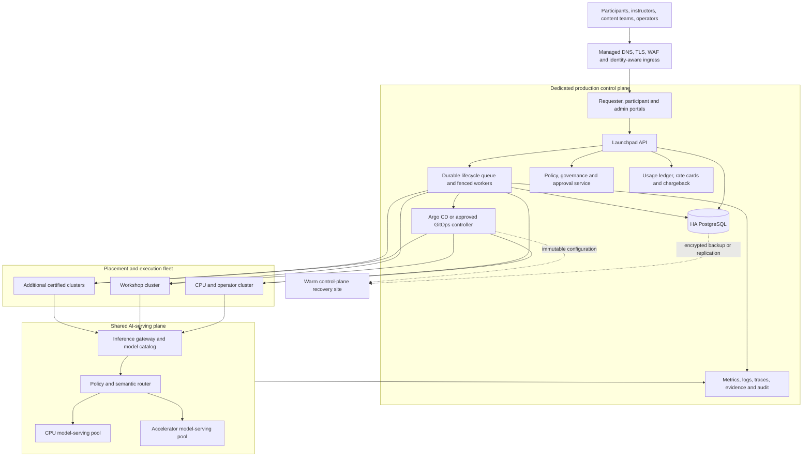
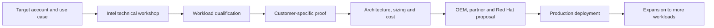
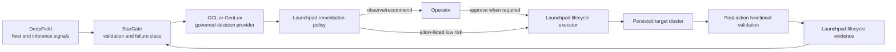

# Launchpad ecosystem architecture and scale roadmap

## Purpose and release boundary

Launchpad is the distributed control plane for ordering, placing, provisioning,
validating, using, observing, and reclaiming Intel and Red Hat lab experiences.
Git holds catalog, Showroom, deployment, certification, and operational
contracts. A workshop is one order with isolated participant seats; every seat
in an order stays on one execution cluster.

The current release is a **supervised internal pilot**, not a production or GA
service. Historical runs proved three staggered 25-seat workshops, 75
overlapping participant journeys, a 60-minute soak, and zero-residue reclaim.
The current retained topology again passed 75/75 functionality but is RED for
single-worker burst resilience after a node-wide probe storm restarted one
Arena ingress router. A later permanent-host public claim passed the complete
one-seat browser journey and the named tunnel survived a connector-pod loss,
but the September 10 `gnr2` outage proved that connector redundancy did not
provide end-to-end worker or stateful control-plane resilience. Manual visual
acceptance, worker-level availability, 25-seat public claim concurrency, and
live per-seat LiteLLM attribution remain separate gates.

## Certified current topology

| Capability | Current state | Boundary |
|---|---|---|
| Arena control plane | Pilot authority; degraded during the September 10 `gnr2` incident | API and PostgreSQL are single replicas pinned to `gnr2`; this topology is not worker-HA |
| Arena execution | Certified for the two named 25-seat event workshops | The two orders are staggered; capacity is not a promise for arbitrary catalogs |
| Brutus execution | Certified for the 25-seat Building an AI Agent workshop | Internal access only; placement uses the persisted remote client |
| Oberon execution | Excluded | KubeVirt/HCO and namespace deletion must be remediated and recertified |
| Flightpath | Passive DR candidate | No active writer; promotion requires Arena fencing, restore, and a drill |
| Public participant access | Permanent-host pilot | `labs.smg-helix.ai` and one complete participant journey are GREEN-live; 25-claim concurrency and end-to-end worker HA remain pending |
| Model attribution | Contract GREEN-local | Arena participant inference still uses direct OVMS/vLLM endpoints; live per-seat LiteLLM metrics are unavailable |

## September 10 resilience finding and correction

When `gnr2` stopped reporting, both named-tunnel connector replacements, the
public gateway, portal, and admin application recovered after `rhgnr1` was
uncordoned. The public edge health check returned HTTP 200 again. PostgreSQL and
the backend did not recover because their single replicas are pinned to
`gnr2`; the lifecycle worker correctly refused to operate without PostgreSQL.
The resulting service could display an edge health response but could not
reliably accept claims, orders, provisioning, validation, or reclaim work.

This incident establishes the following boundaries:

- multiple pods and a PodDisruptionBudget do not protect against loss of their
  only eligible worker;
- preferred anti-affinity does not create a second failure domain;
- a singleton RWO database remains the control-plane availability boundary;
- hostname pinning converts one worker outage into an application outage;
- edge or router health must not be treated as transaction-path health;
- a Ready worker requires workload-start, network, ingress, storage, model, and
  sustained-stability proof before it becomes placement-eligible.

The pre-event response is to restore and qualify `gnr2`, retain `rhgnr1` only
after its workload canary and stability soak pass, pause admission whenever the
control-plane dependency set or required worker count is unhealthy, back up the
database, and repeat the exact staggered 75-seat rehearsal. An untested database
move while the failed node is unfenced is prohibited. September 17 remains a
supervised pilot with tested recovery rather than an HA declaration.

The post-pilot correction externalizes process-local backend state, runs
multiple stateless API and gateway replicas across failure domains, replaces
hostname pins with a certified control-plane pool, introduces HA PostgreSQL and
durable lifecycle coordination, separates control-plane capacity from
participant bursts, and exercises Flightpath as a fenced warm recovery site.
End-to-end readiness must prove identity, database, API, lifecycle queue, model
routing, and participant authorization instead of returning green for the
tunnel router alone.

## Order-to-reclaim lifecycle

The persisted `cluster_ref` is the lifecycle boundary. Create, validation,
retry, expiry, reclaim, and orphan reconciliation must always address that
cluster. Launchpad must never migrate an active seat, retry cleanup against a
different cluster, or split a workshop silently.

## Distributed execution contract

An execution cluster is eligible only when all required facts are known and
healthy:

- explicit API, ingress, Console, storage class, capabilities, and model routes;
- a dedicated least-privilege Launchpad credential stored outside Git;
- a separate Argo CD destination credential;
- durable, immutable images reachable from that cluster;
- sufficient measured CPU, memory, pod, storage, and node headroom;
- required Operators, model endpoints, route/WebSocket behavior, and cleanup;
- a successful 1 -> 5 -> 25 certification for each catalog/cluster pairing.

Missing credentials, health, capacity, or capabilities make the target
ineligible. A theoretical allocatable total is never a published seat limit.

## Heterogeneous cluster and catalog compatibility model

Launchpad should not require every execution cluster to have identical
hardware, Operators, networking, storage, models, or data boundaries. It should
standardize how those differences are declared, validated, selected, observed,
and reclaimed. The support and placement unit is:

`catalog version x cluster profile x certified seat count`

A catalog package declares required capabilities rather than a preferred
cluster name. Requirements include Operators and OpenShift features, CPU and
accelerator classes, per-seat and shared resources, storage behavior, model
capabilities, network and data policy, exposure policy, readiness, functional
journeys, observability, cleanup, and supported scale. A cluster publishes live
facts for the same vocabulary plus recent provisioning latency, failure rate,
capacity reservations, and certification evidence.

Useful profiles include:

| Cluster profile | Distinguishing capabilities | Example experience |
|---|---|---|
| CPU and Operator | Xeon, OpenShift Operators, standard persistent storage | Serve LLMs, agent building, Operator workshops |
| Accelerator | Gaudi or GPU device classes, model runtime, accelerator quotas | Large-model inference, training, hardware comparison |
| Virtualization | KubeVirt/HCO, nested networking and virtualization storage | Infrastructure and virtualization roadshows |
| Public-enabled | Certified public ingress, identity, TLS, WAF, external reachability | External workshops and customer proofs |
| Private or data-local | Approved network and residency boundary, private model access | Regulated or customer-controlled datasets |
| Edge or disconnected | Restricted egress, mirrored images, locally available models | Factory, retail, telco, and sovereign demonstrations |

Placement first applies deterministic eligibility: the required capability,
credential, image, storage, model, network, policy, certification, and complete
workshop capacity must all be present. It then ranks only eligible targets by
retained headroom, catalog-specific reliability, readiness percentile,
reservations, failure-domain preference, locality, energy, and cost. Every
input, rejection, score, policy version, and selected `cluster_ref` is persisted
before any resource is created. AI may forecast readiness or recommend among
the eligible set but cannot make an ineligible pairing eligible.

The participant continues to use one Launchpad entry point. Cluster identity is
an administrator and support concern; generated Showroom, workspace, Console,
and model routes resolve from the persisted binding. One workshop remains on
one execution cluster. If no certified target can fit the entire order,
Launchpad rejects it before creating seats rather than splitting it silently.

Compatibility growth is controlled through certified-pair allowlists, a small
set of versioned cluster profiles, continuous conformance checks, immutable
catalog releases, and targeted recertification triggers. A materially changed
catalog, Operator set, OpenShift version, model, cluster profile, access mode,
or scale invalidates only the affected proof rows. This permits meaningful
cluster differences without turning each lab/cluster combination into bespoke
control-plane code.

## Scale roadmap

| Stage | Objective | Required proof | Status |
|---|---|---|---|
| Pilot baseline | Three staggered 25-seat orders; 75 environments active together | 75/75 journeys, isolation, soak, bulk reclaim, zero residue | GREEN-live automated; manual visual gate pending |
| Repeatable event | Re-run exact topology on demand | Three consecutive current-version runs, readiness percentiles, support rehearsal | Next operational gate |
| More catalogs | Add a quickstart repo without bespoke platform edits | Discovery, intake, source build, 1/5/25 proof contract | Scaffold introduced; adoption per catalog |
| More clusters | Register another CPU execution cluster | Least privilege, images, ingress, model routes, 1/5/25 gates | Playbook path defined |
| Larger workshops | 50 then 75 seats on one cluster | Measured headroom, node stability, functional load, reclaim | Do not advertise yet |
| Multi-event fleet | Concurrent orders across three or more targets | Queue fairness, capacity reservations, SLOs, failure-domain tests | Roadmap |
| Security assurance | Make identity, isolation, secrets, public ingress, software supply chain, data policy, and incident response explicit release gates | Threat model, zero critical/high findings, cross-tenant denial, credential rotation, audit and recovery evidence | Pilot controls active; production assessment pending |
| Repository and delivery foundation | Sanitize and modularize the current source tree; introduce repeatable CI/CD without destabilizing the pilot | Secret/history scan, ownership map, reproducible builds, signed immutable artifacts, promotion evidence | Pre-event sanitation only; structural work after pilot |
| Production service | Stable public ingress, HA/DR, security, support, ownership | Complete production rubric and drills | Post-pilot |

Provisioning performance should be improved through durable queues, bounded
seat waves, pre-seeded images, shared services, and measured cluster/catalog
percentiles. Shared services reduce duplicated pod cost only when namespace
isolation, availability, versioning, and ownership remain explicit. Per-seat
components should not be shared solely to make a capacity preview pass.

## Permanent production home and target architecture

The recommended production home is a dedicated OpenShift control-plane cluster,
referred to here as `launchpad-control-prod`. It is a logical target name, not a
decision to reuse Arena, Brutus, Flightpath, or Oberon. The production owner must
select the physical location, funding model, network boundary, support team, and
recovery site through an architecture review.

The permanent control-plane cluster should not host participant lab workloads or
large model-serving workloads. Keeping those failure domains separate allows the
platform to continue accepting lifecycle events, observing active orders, and
reclaiming resources when an execution or AI-serving cluster is impaired.

### Production control-plane responsibilities

The production control plane owns the business and lifecycle state of the
service:

- one stable requester, participant, and administrator entry point;
- enterprise identity federation, tenant policy, entitlement, and
  namespace-scoped authorization;
- catalog, workshop, seat, reservation, `cluster_ref`, and expiration state;
- durable provisioning and reclaim jobs with leases, fencing, idempotency, and
  dead-letter handling;
- GitOps application generation and cluster-specific credential selection;
- global observability, audit history, immutable certification evidence, and
  usage accounting;
- policy-controlled remediation with an authenticated approval path;
- encrypted backup, restore, failover, and failback procedures.

Production deployment requires multiple API and lifecycle-worker replicas,
highly available PostgreSQL, durable object storage for evidence and backups,
an approved secrets manager, immutable images, and a warm recovery site in a
separate failure domain. The current Flightpath design can inform the recovery
pattern, but the production home and recovery site require an explicit platform
ownership decision.

### Placement and execution clusters

Execution clusters are replaceable capacity pools. Each cluster publishes a
versioned capability and health record that includes API and ingress reachability,
OpenShift version, installed Operators, storage classes, model connectivity,
network boundary, image reachability, allocatable and reserved resources,
failure history, and certified catalog/seat limits.

Placement uses two stages:

1. **Deterministic eligibility:** reject any cluster missing a required
   capability, credential, model, image, network path, storage class, policy,
   or complete-order capacity. These rules are never bypassed by AI.
2. **Auditable scoring:** rank eligible clusters by retained headroom,
   catalog-specific success rate, startup percentile, current reservations,
   failure-domain preference, network locality, energy or cost policy, and
   recent instability. Persist the inputs, score, explanation, policy version,
   and selected `cluster_ref` before creating resources.

Forecasting may later predict workshop readiness or saturation from historical
data. A model may recommend a target only among the deterministically eligible
set. The deterministic scorer remains the fallback when prediction is missing,
stale, low-confidence, or unavailable.

One workshop remains on one execution cluster in the initial production model.
Fleet-level scheduling can place separate workshops on different clusters. A
future split-workshop feature requires an explicit product decision because it
changes participant support, failure handling, networking, evidence, and
reclaim semantics.

### Shared AI-serving and semantic routing plane

The preferred AI architecture separates model serving from participant
namespaces. A shared inference gateway issues tenant/order/seat-scoped
credentials and routes requests to certified CPU or accelerator pools. The
model catalog records model version, endpoint, hardware class, data policy,
context limit, availability, latency, throughput, and rate-card metadata.

Semantic routing should use the least complex method that meets the product
need:

- explicit catalog policy for labs that require a specific model;
- deterministic task classification for embeddings, reranking, chat, tool use,
  and larger generation tasks;
- measured health, latency, capacity, data-boundary, and cost constraints;
- embedding or lightweight classifier routing only when prompts cannot be
  categorized reliably from catalog metadata;
- an optional LLM router only after deterministic and classifier approaches
  fail a measured quality requirement.

Every inference decision must record the requested capability, chosen model and
version, route reason, fallback, latency, token or request usage, tenant, order,
seat, and cost attribution without recording prompt content unless an approved
data policy permits it. Model endpoints remain private. Execution clusters
reach the gateway through approved private network paths, and unavailable model
capabilities remove a cluster/catalog pairing from placement eligibility.

### Intelligent reclamation and lifecycle closure

Reclaim is a first-class workflow rather than a best-effort delete operation.
Each order has an ownership ledger containing every namespace, Application,
Route, RoleBinding, credential, model key, storage claim, reservation, and
external integration created for it.

The production reclaim controller should:

1. deny participant access and revoke model credentials at TTL or owner action;
2. fence new mutations for the order and enqueue an idempotent reclaim job;
3. delete only ledger-owned resources through the persisted cluster client;
4. verify absence across Kubernetes, GitOps, identity, model gateway, storage,
   and Launchpad state;
5. release the capacity reservation only after closure or record a quarantined
   exception with an owner and retry time;
6. retain sanitized evidence and chargeback records according to policy.

Rules and ownership labels handle normal reclaim. AI is useful for classifying
unusual residue, correlating repeated failures, estimating the safest known
runbook, and proposing a bounded action. AI should not infer ownership or delete
unlabeled resources. Ambiguous resources, storage loss, RBAC changes,
cluster-scoped objects, and cross-cluster recovery require human approval.

## AI use within the product

AI should be added only where it improves a measured operating outcome. The
core order, policy, authorization, reservation, and ownership contracts remain
deterministic.

| Product decision | Default mechanism | Optional AI contribution | Required boundary |
|---|---|---|---|
| Eligibility | Versioned policy and live facts | None | AI cannot make an ineligible target eligible |
| Placement | Deterministic filter and score | Demand forecast, readiness estimate, anomaly-aware recommendation | Persist inputs and explanation; deterministic fallback |
| Provisioning | Declarative plans and durable jobs | Classify failures and recommend a known retry or runbook | Allow-listed actions, retry budget, post-validation |
| Model routing | Catalog requirement and policy router | Semantic task classifier when metadata is insufficient | Data policy, model allow-list, observable fallback |
| Reclaim | Ownership ledger and idempotent controller | Residue correlation and bounded remediation proposal | Never infer ownership; approval for ambiguous deletion |
| Support | Runbooks, evidence, and service ownership | Summarize incidents and retrieve relevant proof | No secret or unrestricted telemetry disclosure |
| Chargeback | Metered usage and versioned rate cards | Forecast demand and detect cost anomalies | Finance-approved rules remain authoritative |

The platform does not need a general-purpose AI decision layer for ordinary
CRUD, policy enforcement, identity, catalog validation, or accounting. Adding
one there would increase audit and failure complexity without improving the
service contract.

## Usage accounting, showback, and chargeback

The business solution needs a usage ledger before it needs billing. Every
accepted order should carry tenant, requester, cost center, catalog version,
workshop, seat count, selected cluster, and rate-card version. Runtime meters
then attribute:

- reserved and consumed CPU-core hours and memory GiB-hours;
- accelerator hours by type, model, and serving pool;
- storage GiB-months and retained evidence or dataset storage;
- model requests, input/output tokens where available, and gateway tier;
- public egress or other material network usage;
- shared control-plane and observability overhead using a documented allocation
  method;
- optional support or custom-content cost when the business model requires it.

The calculation should separate **estimated at order time**, **reserved during
the workshop**, and **actual after reclaim**. Versioned rate cards preserve the
price assumptions used for each order. The first release should provide
showback and budget alerts. Enforced quotas or internal chargeback follow only
after Finance, product ownership, and tenants approve the allocation rules and
two billing periods reconcile against infrastructure measurements.

Recommended business views are:

- tenant and cost-center spend by month;
- cost per workshop, participant seat, catalog, and completed learner journey;
- reserved versus consumed capacity and idle reservation cost;
- model and hardware cost by workload type;
- provisioning failure, retry, and stranded-resource cost;
- forecast demand, budget threshold, and cluster expansion signal.

Do not present the current `cost_estimate` field as an invoice. It remains a
showback estimate until the usage ledger, rate cards, reconciliation, dispute
process, and ownership model pass their contracts.

## Intel-led prospective sales motion

Launchpad should operate as an Intel-focused solution experience and technical
qualification platform powered by Red Hat OpenShift. It does not replace the
Red Hat Demo Platform. Approved Intel experiences may later graduate into RHDP,
but Intel owns the primary catalog, hardware fleet, model endpoints, telemetry,
capacity, business attribution, and prospective sales process.

The prospective motion connects a workshop to a production decision:

### Catalog qualification ladder

| Experience | Prospective sales purpose | Expected next action |
|---|---|---|
| Serve LLMs on Intel Xeon | Establish whether CPU inference meets the workload's functional, latency, throughput, and cost needs | Size a customer-specific inference proof |
| Building an AI Agent | Identify an initial enterprise agent use case and required tools, data, and controls | Hold an architecture discovery session |
| Build Multi-Agent AI Systems | Qualify orchestration, protocol, model, tool, and governance requirements | Select one production-shaped workflow |
| AgentOps | Expose observability, evaluation, audit, support, and operating-model needs | Define the production operations proof |
| DeepField, StarGate, and GCL or GeoLux paths | Demonstrate fleet signals, validation, governed decisions, and bounded remediation | Review the control and integration architecture |
| Customer-specific experience | Validate the customer's approved model, data shape, workload, and target Intel architecture | Produce a decision package and partner proposal |

The first three experiences create technical interest and qualification. The
operations experiences establish what the customer needs to run the workload
reliably. A customer-specific proof should begin only after an account team and
customer agree on the decision it must support.

### Technical opportunity record

An order may carry an optional sales context containing opaque references to
the account, campaign, Intel seller, partner, Red Hat counterpart, and approved
CRM opportunity. The workshop result should produce a seller-safe technical
record containing:

- use case and intended business outcome;
- tested models, model sizes, concurrency, latency, and throughput requirements;
- data location, privacy, security, and regulatory constraints;
- measured CPU or accelerator fit and recommended Intel architecture;
- OpenShift, OpenShift AI, automation, storage, networking, and Operator needs;
- estimated infrastructure footprint and inference cost assumptions;
- production-readiness gaps, recommended next proof, owners, and decision date;
- evidence references, catalog version, cluster, and rate-card version.

Launchpad should not copy prompts, uploaded customer data, credentials, or
unrestricted operational telemetry into a CRM. Participant registration alone
does not create a sales lead. Any transfer of participant or account data must
follow an approved consent, retention, and access policy.

### Account-team operating model

| Party | Primary responsibility |
|---|---|
| Intel account owner | Select target accounts, own the opportunity, and connect the result to an approved sales record |
| Intel solution architect | Define success criteria, interpret workload evidence, and recommend the Intel architecture |
| Red Hat account or specialist team | Validate the OpenShift, OpenShift AI, Ansible, support, and services path when applicable |
| OEM, distributor, or integrator | Convert the validated architecture into a bill of materials, services plan, and commercial proposal |
| Customer technical owner | Supply the approved workload constraints, judge the proof, and own the production decision |
| Launchpad product and operations team | Deliver the governed environment, preserve evidence, and report only measured outcomes |

Within five business days of a qualifying workshop, the account team should
review the technical record and choose one outcome: close with a documented
reason, continue discovery, schedule a customer-specific proof, or attach the
result to an existing opportunity. The platform should record the outcome
without claiming commercial value before the opportunity owner accepts it.

### Funnel and attribution contract

Launchpad should report a progression rather than treating every participant
as pipeline:

1. registered participant;
2. completed participant journey;
3. technically qualified account;
4. sales-accepted follow-up;
5. customer-specific proof;
6. approved commercial opportunity;
7. proposed Intel/OEM architecture;
8. closed production deployment;
9. expanded workload or additional deployment.

An engagement counts as **sourced pipeline** only when the approved CRM rules
identify Launchpad as the originating motion. It counts as **influenced
pipeline** only after an opportunity owner attaches the evidence to an accepted
opportunity. Closed value must come from the authoritative sales system rather
than an estimate derived from registrations.

Primary product metrics are:

- production deployments influenced per qualified workshop;
- workshop-to-qualified-account conversion;
- qualified-account-to-customer-proof conversion;
- proof-to-proposal and proposal-to-deployment conversion;
- elapsed time from workshop to proof, proposal, and production decision;
- Intel architecture and OEM platform value influenced;
- attached Red Hat subscription or services opportunity where applicable;
- expansion revenue or additional workloads after the first deployment;
- cost per completed participant, qualified account, proof, and deployment.

The sales integration should begin with exported, reviewed evidence and an
opaque opportunity reference. A direct CRM write-back adapter follows only
after field ownership, consent, deduplication, error recovery, and attribution
contracts pass. This keeps the pilot useful to sellers without making CRM
integration a prerequisite for technical delivery.

## Migration path to the production home

The migration moves control-plane authority without moving active participant
namespaces between clusters. Existing sessions finish or reclaim on their
persisted execution target.

| Phase | Product outcome | Required exit evidence |
|---|---|---|
| 0. Supervised pilot | Preserve the current Arena control plane and certified Arena/Brutus pairings | Manual visual acceptance, current 3 x 25 evidence, support rehearsal |
| 1. Portable foundation | Remove cluster-local assumptions from images, secrets, storage, ingress, model routes, and configuration | Clean install and one-seat order on a temporary control-plane target |
| 2. Production home | Install the dedicated control plane, enterprise identity, HA database, durable queue, GitOps, evidence store, observability, and secrets management | Restore, restart, fencing, audit, and one-seat lifecycle tests |
| 3. Execution fleet | Register Arena, Brutus, and later clusters with dedicated provisioner and GitOps identities | Per catalog/cluster 1, 5, and 25 proof plus zero-residue reclaim |
| 4. AI-serving plane | Introduce the private model gateway, catalog, routing policy, scoped keys, and usage attribution | Required-model, fallback, isolation, load, and cost-meter tests |
| 5. Parallel verification | Mirror catalog and policy versions while the pilot remains the authority; send only controlled canary orders to the new home | Three consecutive mixed-cluster certification runs and reconciled usage data |
| 6. Controlled cutover | Drain new pilot orders, fence old control-plane writers, restore or replicate state, switch stable ingress, and enable new workers in order | Measured RPO/RTO, no duplicate writer, preserved `cluster_ref`, successful new order and reclaim |
| 7. Managed production | Add SLOs, on-call ownership, capacity forecasts, showback, approved chargeback, and graduated remediation | Production rubric, security review, DR drills, financial reconciliation, support sign-off |

The permanent URL should front the logical service rather than a cluster name.
DNS and identity stay stable when the control plane moves or fails over. Cluster
URLs remain implementation details exposed only where a participant explicitly
needs an OpenShift Console or lab endpoint.

## Production product roadmap

| Horizon | Product capability | Decision boundary |
|---|---|---|
| Internal pilot | Repeatable catalog, whole-workshop placement, guided participant experience, evidence, and zero-residue reclaim | Supervised operations and internal access |
| Durable service | Permanent control-plane home, HA lifecycle, stable identity/ingress, centralized observability, and tested DR | Production service ownership and SLO approval |
| Security foundation | Enterprise administration identity, least-privilege workload identity, managed secrets, private service boundaries, secure supply chain, audit and response | Independent threat model and security review; zero unresolved critical/high findings |
| Managed fleet | Policy-based cluster registration, reservations, predictive readiness, failure-domain placement, and capacity planning | Certified catalog/cluster pairs only |
| AI platform | Private multi-hardware serving, semantic routing where justified, per-seat attribution, and model governance | Deterministic eligibility and data policy remain authoritative |
| Business service | Intel-led opportunity qualification, tenant budgets, showback, rate cards, approved chargeback, catalog economics, and demand forecasts | Sales attribution and Finance-approved allocation rules |
| Governed autonomy | Evidence-driven recommendations followed by allow-listed automatic remediation and reclaim | One failure class earns autonomy at a time |

## GitOps and Argo CD deployment decision

Argo CD remains the recommended deployment reconciler, while Launchpad remains
the lifecycle authority. This boundary is important: GitOps describes and
reconciles desired platform state; it is not the transaction log for workshop
orders, capacity reservations, seat claims, TTLs, or reclaim.

| Concern | Authoritative owner |
|---|---|
| Control-plane services, shared execution-cluster services, policies, cluster baselines, and versioned catalog releases | Git and Argo CD |
| Orders, workshop and seat assignments, `cluster_ref`, reservations, entitlements, TTL, lifecycle jobs, and audit mutations | Launchpad database and workers |
| Resource convergence inside a cluster | Kubernetes and installed Operators |
| Functional readiness, participant journeys, performance, and zero-residue proof | Launchpad certification and evidence pipeline |

For the current fleet, use one highly available central Argo CD instance on the
dedicated control-plane cluster. Register each execution cluster with its own
least-privilege GitOps identity, constrain destinations and resource kinds with
AppProjects, and use ApplicationSets for repeatable long-lived cluster stacks
and catalog releases. Do not create a Git commit for every participant seat.
When a catalog needs an Argo CD Application per workshop, Launchpad persists its
identity and target cluster before creation, observes reconciliation, then runs
functional probes before declaring the workshop ready.

The main drawbacks and required mitigations are:

- reconciliation is asynchronous, and `Synced` or Kubernetes health does not
  prove that Showroom, an operator workflow, or a model is usable; retain
  inference-aware and browser/API functional certification;
- unreachable destination clusters, finalizers, pruning, and cascading deletion
  can delay teardown; Launchpad needs durable cleanup jobs, explicit fencing,
  orphan detection, bounded retries, and an audited manual recovery path;
- a central Argo CD installation and its remote-cluster credentials create a
  control-plane dependency and blast radius; run it HA, use separate scoped
  identities per cluster, monitor it, back it up, and exercise loss-of-cluster
  and restore scenarios;
- repo-server manifest generation, application-controller queues, cluster
  caches, and monorepo traversal can bottleneck as application and cluster count
  rise; measure reconciliation latency and scale or shard only from evidence;
- sync waves and hooks help order deployment but are not durable workflow or
  transaction semantics; lifecycle state, retries, compensation, and capacity
  ownership remain in Launchpad;
- automatic self-healing can reverse emergency changes; define a time-bounded,
  audited incident override and a deliberate path for reconciling the approved
  fix back to Git;
- secrets do not belong in Git; use an approved external secrets system or
  encrypted-secret workflow and deploy immutable, signed image digests with
  provenance.

Do not add an independent Argo CD instance to every execution cluster for the
pilot. Reassess central versus regional/failure-domain instances only after
fleet size, network partitions, organizational boundaries, or measured
controller load justify the added operational cost. RHACM remains a later
option when direct registration and policy distribution become unwieldy.

## Security architecture and assurance roadmap

Security is a product capability and release boundary, not a final CI check.
Launchpad crosses public ingress, identity, control-plane, execution-cluster,
model-serving, content-supply-chain, and operational-administration trust
boundaries. Each boundary requires an explicit owner, policy, audit trail,
failure mode, and certification result.

The governing principles are:

- private by default and fail closed when identity, policy, cluster credentials,
  model authorization, or audit dependencies are unavailable;
- least privilege for people, services, cluster provisioners, GitOps, model
  access, and automation, with no routine use of `kubeadmin` or shared
  administrator credentials;
- separation of participant, instructor, requester, platform operator,
  content-publisher, security reviewer, and break-glass authority;
- one participant or workshop entitlement grants access only to its assigned
  seat, namespace, approved tools, model policy, and expiration window;
- immutable and attributable software, content, configuration, policy, and
  evidence from source through deployment and reclaim;
- minimized collection of email labels, prompts, documents, model traces, and
  customer context, with documented purpose, retention, access, and deletion;
- deterministic authorization and ownership. AI may summarize evidence or
  recommend an allow-listed response but cannot grant access, bypass policy,
  infer resource ownership, or approve destructive remediation.

### Security gates before September 17

The pilot should add only bounded, testable controls before the event freeze:

1. Run repository and history-aware secret detection, dependency scanning,
   container/image scanning, rendered-manifest review, and license/policy checks
   on the exact release candidate. Store results in the evidence manifest.
2. Inventory every public Route and tunnel path. Permit only the participant
   gateway and required identity endpoints; keep APIs, model endpoints,
   PostgreSQL, Argo CD, administration, and cluster credentials private.
3. Revalidate namespace RoleBindings, cross-seat and cross-tenant denial,
   service-account scope, remote-cluster credentials, NetworkPolicies, and model
   key scope for all three event catalogs.
4. Treat the shared instructor code as a bearer secret: reveal it once, transmit
   it privately, rate-limit attempts, rotate it on suspected disclosure, deny
   access immediately at rotation or TTL, and audit claims and removals. Pilot
   email remains an unverified identity label and must be described that way.
5. Complete the Keycloak 26.7.2 live rollout and rollback browser gate before
   using public access for the event. If that gate or the 25-claim abuse test is
   not green, use the internal access path for September 17.
6. Verify logout, session revocation, RoleBinding removal, model-key revocation,
   bulk reclaim, and zero identity/namespace/Route residue. Do not infer access
   cleanup from pod deletion.
7. Prepare a security incident path covering leaked instructor codes,
   compromised participant sessions, cross-tenant access, exposed credentials,
   vulnerable images, audit loss, and public-edge abuse. Name the owner and
   event-day authority to rotate, disable, isolate, or reclaim.

The pilot security release gate requires zero known critical or high findings,
zero successful cross-seat or cross-tenant authorization, no plaintext secrets
in Git or evidence, trusted TLS, successful rate-limit behavior, complete audit
events, and immediate denial after rotation, expiration, or participant
removal. Native public OpenShift Console access remains outside the September
pilot unless separately threat-modeled and certified.

### Production security foundation after September 17

Production maturation adds:

- enterprise federation and MFA for requester, administrator, publisher, and
  break-glass roles, with documented participant assurance levels by exposure
  policy and use case;
- an approved secrets manager, automatic rotation, short-lived workload and
  cluster identities, certificate lifecycle management, and removal of static
  credentials from application configuration;
- dedicated provisioner and GitOps identities per execution cluster, bounded
  impersonation, admission policy, default-deny networking, controlled egress,
  and private authenticated connectivity to model and control-plane services;
- signed images and content bundles, SBOMs, provenance attestations,
  vulnerability and license policy, dependency update ownership, registry
  retention, and deployment by immutable digest;
- centralized tamper-evident audit, security telemetry, alert routing, SIEM
  integration, incident response, forensic retention, and tested credential and
  signing-key recovery;
- explicit data classification for participant identity, uploaded documents,
  prompts, model output, traces, evidence, sales context, and billing records,
  including residency, consent, redaction, retention, export, and deletion;
- independent threat modeling, architecture review, penetration testing, abuse
  testing, backup/restore validation, DR security review, and recurring access
  recertification before GA.

Every catalog/cluster certification records its security profile alongside
functional and capacity proof. Material changes to identity, public exposure,
OpenShift or Operator versions, network boundary, model route, base image,
service account, or data policy trigger targeted security recertification.
Automation graduates from observe to recommend to approve to automatic only
after one bounded failure class passes abuse, rollback, audit, and blast-radius
tests.

## Repository sanitation, organization, and CI/CD

Repository work is part of the product architecture because source ownership,
artifact provenance, deployment promotion, and secret boundaries determine
whether Launchpad can be operated safely. It must be staged so repository
reorganization does not destabilize the September 17 pilot.

### Before September 17: sanitation without structural migration

Keep the current monorepo for the event candidate. Apply only low-risk controls:

- run pre-commit secret detection, dependency audits, tests, rendered-manifest
  validation, and generated-file checks on every event-candidate change;
- inventory ignored and untracked files, remove conflicting obsolete deployment
  paths from the release process, and keep kubeconfigs, access codes, tunnel
  tokens, local evidence, and credentials outside Git;
- document the authoritative location for backend, web surfaces, public access,
  deployment overlays, catalog content, certification, and runbooks;
- freeze release inputs by commit SHA, image digest, catalog version, Showroom
  tag, and evidence manifest;
- avoid Git-history rewrites, repository extraction, directory-wide renames, or
  build-system replacement during the event freeze.

The event branch should require a compact pilot CI lane: formatting and lint,
unit tests, provider/consumer contracts, frontend builds, `kustomize` rendering,
secret scanning, dependency scanning, and the deterministic certification
driver. Live `1 -> 5 -> 25` certification remains a controlled promotion gate,
not a job executed on every pull request.

### After September 17: modularize first, then extract

Do not split the monorepo merely to reduce its file count. First define bounded
modules, dependency direction, owners, versioned APIs, and artifact boundaries
inside the current repository. Add CODEOWNERS, architecture decision records,
component manifests, independent test commands, and independent image/version
metadata. A module is ready to extract only when it has a stable contract, a
named owner, an independent release cadence, and no reliance on relative source
paths or shared mutable deployment state.

The recommended initial destination is a small three-repository model:

1. **Launchpad product:** API, lifecycle workers, placement, participant access,
   requester/admin applications, shared schemas, and contract tests. Split a
   component further only if its security or release ownership diverges.
2. **Launchpad catalog and content:** catalog records, Antora/Showroom content,
   intake definitions, catalog certification profiles, and immutable content
   releases. Individual lab source repositories can publish versioned catalog
   packages through the onboarding pipeline.
3. **Launchpad environments:** sanitized GitOps configuration for control-plane
   and execution targets, promotion policy, and environment-specific references.
   Credentials and secret values remain in an approved secrets manager, never
   in this repository.

Large run evidence belongs in durable object storage in production. Git should
retain schemas, signed manifests, hashes, compact decisions, and links rather
than indefinitely accumulating pod dumps, logs, screenshots, and generated
reports. Binary presentations and other non-runtime artifacts should use Git
LFS or a versioned release/document store if their volume becomes material.

### Delivery and promotion pipeline

The target CI/CD flow is:

1. **Change validation:** formatting, lint, unit, component, contract, BDD,
   frontend accessibility/build, manifest schema/render, secret, dependency,
   license, and policy checks.
2. **Artifact build:** reproducible component images and content bundles tagged
   by version and commit, each with SBOM, vulnerability result, signature, and
   provenance attestation.
3. **Integration promotion:** deploy by digest to a disposable or development
   environment; run migrations, contracts, one-seat lifecycle, public/internal
   routing, model, authorization, rollback, and zero-residue reclaim tests.
4. **Pilot certification:** run catalog/cluster `1 -> 5 -> 25` gates, concurrency
   and fault tests, then publish an immutable evidence manifest and rubric.
5. **Production promotion:** promote the identical digests and content versions
   through GitOps after approval. Never rebuild between environments. Verify
   health, migrations, rollback, audit events, and post-deployment evidence.

Branch protection should require the appropriate CI lane and review ownership.
Emergency changes use the same immutable build and evidence path with an
expedited approval record; direct mutable cluster edits are reconciled back to
Git or explicitly recorded as incident actions.

## Operations intelligence and auto-remediation

The proposed integrations are shared control-plane services, not a bundle
copied into every participant namespace.

| System | Intended role | Current maturity |
|---|---|---|
| Launchpad | Lifecycle authority, ownership, policy enforcement, execution, audit | Active pilot |
| StarGate | Preflight constraints, readiness evidence, failure classification, remediation callback contract | Adapter/contracts exist; production autonomy not certified |
| DeepField | Fleet, network, and inference signals for placement and incident context | Adapter exists; participant access and TLS hardening remain gated |
| GCL or GeoLux | Governed hypothesis/decision provider operating on bounded evidence | Selection and contract spike pending; neither is an execution authority |

GCL and GeoLux should first implement the same versioned decision-provider
contract: evidence references in, proposed action, confidence, constraints,
risk, explanation, and expiry out. Choose one after a contract spike measuring
fit, operability, security boundary, latency, and ownership. Deploying both
before that decision adds complexity without improving the pilot.

Remediation graduates one failure class at a time:

1. **Observe:** attach evidence; an operator follows the runbook.
2. **Recommend:** propose one bounded action and show affected resources.
3. **Approve:** an authenticated operator authorizes an idempotent execution.
4. **Automatic:** allow-list a low-risk action with retry budget, circuit breaker,
   post-validation, and escalation.

First candidates are delayed validation retry, owned Showroom resync, generated
Route reconciliation, bounded managed-workload restart, expired-session
reclaim, and stale-record repair. RBAC, Secrets, cluster-scoped Operators,
storage deletion, node repair, shared models, DNS/certificates, and cross-cluster
migration always require human authority.

## Source-of-truth map

| Concern | Repository contract |
|---|---|
| Cluster registry | `config/clusters.yaml` |
| Control-plane deployment | `deploy/launchpad/overlays/arena` and HA pilot overlay |
| Remote registration | `deploy/multicluster/` |
| Portable orchestration | `deploy/ecosystem/` |
| Catalog intake | `catalog-onboarding/<catalog-id>.yaml` |
| Catalog record | `catalog/<catalog-id>/catalog-item.yaml` |
| Learner journey | `content*/` Antora/AsciiDoc |
| Deterministic proof | `certification/catalog/` and `scripts/catalog_certification.py` |
| Immutable run evidence | `evidence/` and `evidence/runs/` |
| Security boundaries and release gates | This roadmap, `docs/PUBLIC_ACCESS.md`, `deploy/launchpad/public-access/`, NetworkPolicies, RBAC, and security evidence |
| Support and recovery | `docs/support-runbook.md` and cluster-specific runbooks |

## Architecture decisions still open

- physical owner, region, funding source, and service name for the permanent
  production control-plane cluster;
- active/standby topology, database replication method, recovery objectives,
  and durable evidence/backup location;
- GCL versus GeoLux as the governed decision provider;
- durable public DNS, certificate, and ingress ownership;
- dedicated AI-serving cluster versus certified model pools distributed across
  execution clusters;
- live per-seat LiteLLM routing, semantic-routing policy, data retention, and
  attribution;
- Flightpath promotion/failback rehearsal and recovery objectives;
- third execution cluster and larger single-cluster workshop limits;
- showback allocation rules, rate-card ownership, budget enforcement, and the
  approval boundary for internal chargeback;
- approved CRM, consent and retention policy, account/opportunity ownership,
  and sourced-versus-influenced attribution rules for the Intel sales motion;
- enterprise identity provider, participant assurance levels, secrets manager,
  certificate authority, SIEM, security ownership, retention policy, and
  independent assessment scope;
- the measured cluster/application threshold for central versus regional Argo
  CD, ApplicationSet ownership boundaries, and the approved GitOps secrets
  integration;
- service ownership and support rotations for a production deployment.
