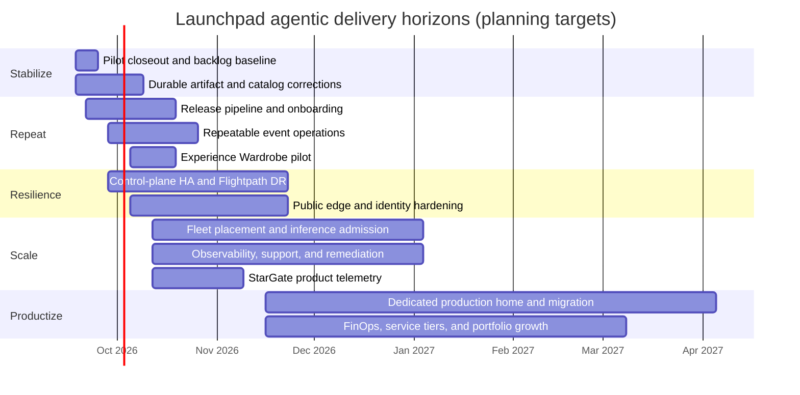

# Launchpad product delivery roadmap

## Purpose

This document translates the target architecture into a sequenced delivery
plan of outcomes, epics, user stories, tasks, dependencies, and evidence gates.
It is the delivery view of
[`ecosystem-architecture-roadmap.md`](ecosystem-architecture-roadmap.md), not a
replacement for that architecture. Active defects and features are tracked in
[`pilot-issue-feature-register-20260917.md`](pilot-issue-feature-register-20260917.md).

Dates below are planning targets beginning after the September 17, 2026 pilot.
They assume agentic software delivery: multiple bounded implementation,
documentation, test, evidence, and review workstreams proceed in parallel with
human product and operational oversight. They become commitments only after
owners, capacity, infrastructure access, and funding are assigned. Security,
evidence, documentation, observability, and zero-residue cleanup are part of
every increment rather than final hardening phases.

Agentic delivery compresses code discovery, scaffolding, implementation,
refactoring, test generation, documentation, and evidence assembly. It does not
remove elapsed-time gates such as hardware delivery, DNS/certificate approval,
external service ownership, retention windows, node soak, concurrent load,
security acceptance, disaster-recovery drills, or human validation of industry
claims. Estimates therefore state both **build effort** and **proof/decision
latency** rather than treating all elapsed time as typing time.

## Living dashboard

Open the clickable
[`product-roadmap-dashboard.html`](product-roadmap-dashboard.html) for the Gantt,
delivery hierarchy, September 17 pilot postmortem, TDD/EDD/CDD/BDD/CBT matrix,
and 100-point release rubric.
The roadmap Markdown owns scope and schedule;
[`product-roadmap-status.json`](product-roadmap-status.json) owns proof status,
evidence links, and accepted rubric points. The dated
[`september-17-pilot-postmortem.json`](september-17-pilot-postmortem.json)
owns the event snapshot used by the postmortem tab; later reclaim or completion
evidence must append a new snapshot rather than rewriting the observed event.

Record a test result with the status helper rather than hand-editing the HTML:

```bash
python3 scripts/update_product_roadmap_status.py \
  --task LP-T008 \
  --method tdd \
  --stage green-local \
  --evidence evidence/runs/catalog-image-test.json
```

The helper validates the task and evidence path, updates the ledger, and
regenerates the dashboard. Pre-commit refreshes the page when its sources
change, and CI can use `python3 scripts/generate_product_roadmap_dashboard.py
--check` to reject stale output. A declared task remains effectively RED until
all five proof methods have reached its declared stage; production requires all
critical tasks GREEN-live and a 100/100 accepted rubric.

## Delivery hierarchy

- **Outcome:** measurable user or business result delivered by a horizon.
- **Epic (`LP-E###`):** a cross-component capability that may span releases.
- **Story (`LP-S###`):** independently demonstrable user or operator value.
- **Task (`LP-T###`):** implementation or verification work needed by a story.
- **Defect/performance item:** stable `PILOT-BUG-*` or `PILOT-PERF-*` record in
  the issue register.
- **Evidence gate:** objective proof required before the story or epic is done.

A story is not done when its pods are running. It is done when its contract,
functional journey, authorization, failure behavior, observability, cleanup,
documentation, and evidence have passed at the declared scale.

## Timeline at a glance



## Agentic estimation model

These estimates assume two or three coordinated agentic workstreams plus one
human product/architecture owner and access to the required environments.
Workstreams share contracts and evidence rather than independently mutating the
same files or clusters.

| Epic | Agentic build estimate | Proof or external gate | Expected elapsed window |
|---|---:|---|---:|
| LP-E001 Pilot closeout | 2–3 agent-days | retention window and event-owner review | 1 week |
| LP-E002 Immediate catalog corrections | 3–5 agent-days | fresh orders and concurrent participant proof | 2–3 weeks |
| LP-E003 Catalog supply pipeline | 5–10 agent-days | registry, signing, ownership and promotion approval | 3–4 weeks |
| LP-E004 Repeatable event operations | 4–7 agent-days | three rehearsals and reclaim observation | 3–4 weeks |
| LP-E005 Control-plane HA | 8–15 agent-days | HA infrastructure, failure injection and soak | 4–8 weeks |
| LP-E006 Flightpath DR | 5–10 agent-days | hard fencing plus three timed drills | 3–6 weeks |
| LP-E007 Public identity/edge | 5–10 agent-days | DNS/TLS/security decisions and 25-user browser run | 3–7 weeks |
| LP-E008 Fleet management | 7–12 agent-days | credentials and per-cluster certification | 4–8 weeks |
| LP-E009 AI-serving/admission | 7–15 agent-days | model capacity, exact prompt load and hardware availability | 4–10 weeks |
| LP-E010 Operations/observability | 5–10 agent-days | datasource access and injected incident rehearsal | 3–6 weeks |
| LP-E011 Safe remediation | 3–5 agent-days per failure class | authorization, fault and rollback proof per class | continuous |
| LP-E017 StarGate telemetry | 5–10 agent-days | StarGate consumer, retention and security ownership | 3–4 weeks |
| LP-E018 Experience Wardrobe | 4–7 agent-days for pilot | persona/industry SME review and content evaluation | 1–2 weeks pilot; 3–5 weeks productized |
| LP-E012 Production home | 10–20 agent-days | funding, cluster/network delivery, cutover and DR | 3–5 months |
| LP-E013 Security/governance | 7–12 agent-days | independent assessment and remediation acceptance | 4–8 weeks |
| LP-E014 FinOps/service tiers | 5–10 agent-days | finance ownership and telemetry reconciliation | 3–6 weeks |
| LP-E015 Solution portfolio | 3–7 agent-days per solution | solution-owner, data, security and scale review | 2–6 weeks per solution |
| LP-E016 Repository delivery model | 7–15 agent-days, staged | ownership decisions and compatibility soak | 4–8 weeks |

Agent-days are not added to produce the calendar because the roadmap deliberately
overlaps independent epics. The critical path is usually the longest proof or
external-decision gate, not the sum of generated code tasks.

## Horizon 0 — Stabilize and close the pilot

**Target:** September 18–October 9, 2026
**Outcome:** preserve the event record, reclaim safely, and turn every observed
failure into a reproducible backlog item rather than carrying live patches
forward as product behavior.

### LP-E001 — Pilot evidence and lifecycle closeout

**LP-S001 — As an event owner, I can see an immutable result for every workshop
wave so that success, degradation, and failure are not anecdotal.**

- `LP-T001` Capture order, workshop, seat, cluster, catalog revision, model,
  image digest, timestamps, validation, incident, and support data.
- `LP-T002` Run workshop-scoped reclaim after the approved retention window.
- `LP-T003` Verify zero namespaces, Routes, RoleBindings, Argo applications,
  entitlements, model keys, capacity reservations, and orphan records.
- `LP-T004` Publish a signed/hashable evidence manifest and event retrospective.
- **Gate:** all 270 prepared seats have an explained terminal state; retained
  participant access follows policy; reclaim evidence shows zero residue.

**LP-S002 — As a product owner, I have one prioritized backlog linked to pilot
evidence.**

- `LP-T005` Triage every `PILOT-BUG`, `PILOT-PERF`, and `PILOT-FEAT` item.
- `LP-T006` Assign owner, severity, target release, dependency, and proof plan.
- `LP-T007` Add a failing regression test before implementing each defect fix.
- **Gate:** no S0/S1 issue lacks an owner, reproduction, and target horizon.

**LP-S020 — As an operator, I can account for every retained seat and observe
the complete reclaim lifecycle without deleting active work prematurely.**

- `LP-T069` Reconcile workshop/session records with namespaces and resources on
  each persisted execution cluster; report missing records and orphans.
- `LP-T070` Capture claims, creation, expiration, readiness, routes, restarts,
  model dependencies, resource counts, and known risk for every retained
  workshop.
- `LP-T071` At an explicitly approved reclaim window, record every lifecycle
  transition and owned-resource deletion milestone through zero residue.
- `LP-T072` Publish the reclaim duration, failures/retries, residue checks,
  capacity release, audit trail, and evidence hashes without storing secrets or
  participant PII.
- **Gate:** the inventory balances before reclaim; the approved canary and every
  later workshop reach an explained terminal state with zero residue; unrelated
  workshops remain healthy.

### LP-E002 — Immediate catalog corrections

**LP-S003 — As a participant, each promoted lab starts with the correct images,
model, trust, content, and persistent state.**

- `LP-T008` Replace all execution-cluster registry references with approved
  immutable Quay/HA-registry digests. **GREEN-local:** the three pilot catalogs
  now have a fail-closed artifact policy and machine-readable report covering
  immutable Showroom commits and five pinned images; signature, SBOM,
  organization-owned registry, cold-pull, and fresh-seat proof remain open.
- `LP-T009` mount the trusted model CA and remove global TLS verification
  bypasses.
- `LP-T010` Persist AnythingLLM state and make initialization idempotent.
- `LP-T011` Declare tool-calling/model capability requirements in the catalog.
- `LP-T012` Correct the final-synthesis prompt and token budgets for Building an
  AI Agent.
- `LP-T084` Fix Multi-Agent participant UI authentication so agent discovery and
  workflow streaming use the same protected client; distinguish discovery,
  workflow, model, and tool failures in the UI and logs.
- **Gate:** fixes for `PILOT-BUG-001` through `004`, `PILOT-BUG-013`, and
  `PILOT-PERF-001` pass a fresh 1-seat order, restart recovery, functional
  journey, and reclaim.

## Horizon 1 — Make events repeatable

**Target:** September 21–October 30, 2026
**Outcome:** a content owner can promote a catalog release and an operator can
run the same event again without manual image copying or seat mutation.

### LP-E003 — Catalog release and software-supply pipeline

**LP-S004 — As a content owner, I can promote a tested catalog revision without
editing the live environment.**

- `LP-T013` Define the catalog package contract: source commit, Showroom build,
  deployment manifests, image digests, model capabilities, journeys, resource
  envelope, cleanup, and supported targets.
- `LP-T014` Build, scan, generate SBOM, sign, and attest images and content.
- `LP-T015` Add test → approval → production promotion with immutable release
  identity and rollback metadata.
- `LP-T016` Show the exact release identity in requester, participant, and admin
  views.
- `LP-T017` Block promotion when a cross-cluster image, mutable tag, secret, or
  unsupported model is detected. **GREEN-local (artifact subset):** CI and the
  local `catalog-artifacts` gate reject mutable, unapproved, missing, and
  execution-cluster-local image references and retain a JSON receipt. Secret,
  model-compatibility, signature, SBOM, and deployed pullability gates remain.
- **Gate:** one quickstart repository enters through the pipeline and reaches a
  production catalog without a bespoke platform edit.

**LP-S005 — As an operator, I know artifacts will be available before accepting
an order.**

- `LP-T018` Select the durable HA registry/content origin and retention policy.
- `LP-T019` Add destination pull, certificate, architecture, signature, and
  cold-cache checks to eligibility.
- `LP-T020` Pre-pull scheduled-event releases and report cache/mirror status.
- **Gate:** cold-node and registry-restart tests succeed on every certified
  execution cluster.

### LP-E004 — Repeatable event orchestration

**LP-S006 — As an instructor, I can schedule, launch, monitor, and reclaim an
event using a single workflow.**

- `LP-T021` Add a versioned, jointly approved event manifest containing
  cohorts, participants per cohort, labs per participant, retention, exposure,
  staggered order windows, workshop-level status, certified execution
  capacity, DR-reserved capacity, and uncertified capacity. Calculate total
  seat-environments as the sum of `cohort participants × labs assigned`; never
  infer it from participant count alone.
- `LP-T022` Add bounded seat waves, durable/fenced lifecycle jobs, retry budgets,
  and bulk reclaim.
- `LP-T023` Produce instructor links/codes, readiness estimates, seat claims,
  support state, and evidence from the event record.
- `LP-T024` Automate the exact documented journey at 1, 5, then 25/30 seats.
- **Gate:** three consecutive current-release rehearsals meet the catalog ×
  cluster × exposure SLO and reclaim with zero residue.

### LP-E018 — Agentic Experience Wardrobe

**LP-S023 — As an instructor, I can choose a curated persona and industry lens
for a workshop without creating another infrastructure implementation.**

- `LP-T085` Define a versioned `experience_profile` contract containing persona,
  industry, depth, objective, scenario, content modules, prompts, sample data,
  checkpoints, deliverables, compatibility, and evidence requirements.
- `LP-T086` Persist the default and allowed profiles on the workshop and the
  selected profile on the participant entitlement/seat.
- `LP-T087` Add instructor defaults and participant selection/resume while
  preserving one stable lab URL and identity session.
- `LP-T088` Render profile-specific Showroom navigation, language, examples,
  prompts, datasets, business outcomes, and leave-behind assets from the same
  certified runtime release.
- `LP-T089` Treat any profile that changes Operators, RBAC, models, storage,
  networking, resource envelope, or data policy as a separately certified
  catalog profile rather than a content wardrobe.
- **Gate:** one lab supports at least three curated profiles, switching content
  does not restart the lab, resume preserves the selected profile, and runtime
  isolation/capacity evidence remains unchanged.

**LP-S024 — As a content owner, I can use agentic AI to generate and maintain
wardrobe content without publishing unsupported industry claims or divergent
instructions.**

- `LP-T090` Create a retrieval-grounded generation workflow using approved core
  lab facts, brand guidance, persona outcomes, vertical vocabulary, and source
  citations.
- `LP-T091` Generate profile modules, prompts, sample data, checkpoints,
  accessibility text, instructor notes, and evaluation cases as reviewable Git
  changes—not direct production mutations.
- `LP-T092` Add automated structural, link, command, expected-output, terminology,
  hallucination, sensitive-data, accessibility, and brand checks.
- `LP-T093` Require named human SME approval for regulated, safety-sensitive,
  performance, financial, healthcare, public-sector, or product claims.
- `LP-T094` Measure completion, confusion, failure, model usage, and business
  outcome by bounded `experience_profile`; never use participant identity as a
  metric label.
- **Gate:** every published profile has source provenance, reviewer identity,
  content/evaluation results, participant-journey evidence, and rollback to the
  core/default experience.

## Horizon 2 — Resilient control plane and public access

**Target:** September 28–November 27, 2026
**Outcome:** a worker, connector, API pod, or active-site failure does not create
ambiguous lifecycle state or strand participants.

### LP-E005 — Control-plane high availability

**LP-S007 — As an operator, the control plane remains transactional when one
eligible worker or stateless replica fails.**

- `LP-T025` Externalize process-local state and run stateless API, portal,
  gateway, and lifecycle workers across failure domains.
- `LP-T026` Deploy HA PostgreSQL, durable queues/leases, fencing, backups, and
  tested restore.
- `LP-T027` Remove hostname pins and separate control-plane capacity from seat
  bursts.
- `LP-T028` Make health require database, queue, identity, placement, model, and
  participant authorization—not edge HTTP alone.
- **Gate:** worker and pod fault injection preserves accepted lifecycle work and
  stays within the agreed RPO/RTO.

### LP-E006 — Fenced Flightpath disaster recovery

**LP-S008 — As an incident commander, I can promote Flightpath and fail back
without split brain or retargeting active cleanup.**

- `LP-T029` Automate immutable backup replication and recovery-state reporting.
- `LP-T030` Implement hard fencing, GitOps ownership transfer, public-edge and
  identity recovery, restore validation, and failback.
- `LP-T031` Execute three consecutive disaster-recovery drills.
- **Gate:** five-minute RPO and fifteen-minute RTO are demonstrated, all active
  `cluster_ref` values remain correct, and audit/evidence is complete.

### LP-E007 — Highly available public identity and edge

**LP-S009 — As a participant, I can claim and resume my labs through one stable
entry point during a connector or worker failure.**

- `LP-T032` Run multiple tunnel/edge connectors with topology spread, PDBs, and
  route-aware health.
- `LP-T033` Harden Keycloak, entitlement gateway, code rotation, session
  revocation, rate limiting, and identity cleanup.
- `LP-T034` Certify Showroom, proxied tools, workspace, namespace-scoped Console,
  add-lab, my-labs, logout, and re-entry paths.
- `LP-T035` Decide the long-term public DNS/TLS/WAF architecture and migration
  from the pilot tunnel.
- **Gate:** 25 simultaneous claims meet the latency/error SLO; connector and
  worker failure do not break an established participant journey.

## Horizon 3 — Intelligent fleet scale and operations

**Target:** October 12, 2026–January 15, 2027
**Outcome:** Launchpad places complete workshops using measured cluster,
artifact, and inference capacity and operates them with actionable evidence.

### LP-E008 — Heterogeneous execution-fleet management

**LP-S010 — As a requester, my whole workshop is placed on an eligible cluster
with a clear capacity explanation.**

- `LP-T036` Version cluster profiles, capabilities, credentials, storage,
  ingress, exposure, model, artifact, and certification facts.
- `LP-T037` Reserve aggregate CPU, memory, pods, storage, route, and model
  capacity atomically before provisioning.
- `LP-T038` Rank only eligible clusters and persist inputs, rejections, score,
  policy version, and selected `cluster_ref`.
- `LP-T039` Add drain, maintenance, quarantine, requalification, and retirement
  workflows.
- **Gate:** concurrent orders never overbook or split a workshop; create,
  validation, expiry, and reclaim touch only the persisted cluster.

**LP-S011 — As a product owner, I can choose the justified deployment class for
each lab.**

- `LP-T040` Add shared namespace, dedicated workshop cluster, and exceptional
  dedicated seat cluster to the catalog contract.
- `LP-T041` Score labs through the security, operator, data, networking,
  performance, isolation, cost, and teardown rubric.
- `LP-T042` Integrate cluster provisioning beneath Launchpad only for forecasted
  or justified dedicated capacity.
- **Gate:** each promoted catalog records its deployment-class decision and
  evidence; ordinary namespace labs do not create clusters per seat.

### LP-E009 — Governed AI-serving and semantic routing plane

**LP-S012 — As a requester, my catalog is admitted only when compatible model
capacity is available.**

- `LP-T043` Publish model capabilities, versions, context/tool support, trust,
  rate limits, health, and cost.
- `LP-T044` Measure replicas, active/queued requests, tokens, latency, failures,
  and workshop reservations.
- `LP-T045` Add deterministic inference admission and policy routing; use AI
  only to forecast or recommend among already eligible choices.
- `LP-T046` Support approved CPU, accelerator, and semantic-routing pools
  without exposing model endpoints publicly.
- **Gate:** an intentionally saturated or incompatible model prevents admission
  before seat creation; a compatible order completes its functional load test.

### LP-E010 — Operations, observability, and support

**LP-S013 — As an operator, I can identify whether a failure is seat, catalog,
cluster, edge, artifact, MCP, or model related from one console.**

- `LP-T047` Deliver lab/seat cells with state, stage, usage, latency, retries,
  error class, resource pressure, and participant-safe identifiers.
- `LP-T048` Deliver model and cluster views with queue, token, replica, node,
  route, storage, capacity, and reservation data.
- `LP-T049` Add alert ownership, runbook links, incident timelines, evidence
  capture, and backlog linkage.
- `LP-T050` Define service SLOs and support escalation for event and steady use.
- **Gate:** injected failures produce the correct signal, alert, runbook, audit,
  and resolution evidence without relying on unrestricted cluster access.

### LP-E011 — Safe self-service and remediation

**LP-S014 — As an operator, low-risk repeatable failures can be corrected
safely without granting the platform unrestricted mutation authority.**

- `LP-T051` Normalize failure classes and introduce observe → recommend →
  approve → allow-listed automatic execution stages.
- `LP-T052` Start with validation retry, Showroom resync, owned Route recreation,
  failed-seat retry, expiration, and orphan reconciliation.
- `LP-T053` Require immutable target identity, idempotency, retry budgets,
  circuit breakers, post-validation, audit, and escalation.
- **Gate:** every automated action passes fault injection and cannot mutate a
  different tenant, workshop, cluster, or shared infrastructure component.

### LP-E017 — StarGate product telemetry and evidence

**LP-S021 — As StarGate, I receive durable, versioned, privacy-safe lifecycle
evidence so that I can classify failures without becoming the lifecycle source
of truth.**

- `LP-T073` Version the event taxonomy and producer/consumer schema for orders,
  placement, seats, access, artifacts, models, validation, incidents,
  remediation, and reclaim.
- `LP-T074` Add transactionally persisted outbox records, fenced publishers,
  receipts, idempotent consumer handling, bounded retries, dead-letter state,
  and replay.
- `LP-T075` Add correlation, causation, aggregate sequence, `cluster_ref`,
  catalog release, model/artifact dependency, actor, and evidence references.
- `LP-T076` Correct outcome mappings, including `cleanup_failed`, and reject
  unknown or incompatible schemas.
- `LP-T077` Enforce the logging and sensitive-data policy; add delivery, lag,
  coverage, sequence-gap, and failure-class telemetry.
- `LP-T078` Prove StarGate downtime never blocks Launchpad and no accepted
  lifecycle event is lost through restart/network fault tests.
- `LP-T095` Emit privacy-safe `lab.step.started`, `lab.step.executed`, `lab.step.succeeded`, `lab.step.failed`, and `lab.checkpoint.completed` events.
  Correlate stable catalog release, module, step, curated command, workshop,
  seat, and anonymized participant identifiers with outcome, duration,
  timestamp, and execution source. Preserve separate `claimed`,
  `authenticated`, `opened`, `active`, and `completed` journey states. Record
  a stable command ID or content digest for curated Showroom actions, never raw
  terminal commands. Exclude raw prompts, responses, documents, codes,
  secrets, and email from analytical evidence; never infer execution or
  completion from a button click, claim, route request, or authorization check.
- **Gate:** 1-seat, 5-seat, and certified-scale runs have complete ordered
  receipts and reclaim evidence with zero secrets/PII in logs or metrics.

**LP-S022 — As a product or operations owner, I can see StarGate in the product
list with truthful health, maturity, coverage, and evidence.**

- `LP-T079` Define the bounded StarGate product-summary API and UI contract.
- `LP-T080` Show owner, version, supported schemas/events, health, last receipt,
  consumer lag, queued-event age, capability maturity, coverage, and evidence.
- `LP-T081` Mark evidence, preflight, classification, recommendation, approved
  execution, and automatic execution as separate maturity states.
- `LP-T082` Require a recent synthetic event round trip; do not infer health
  from Route or pod readiness alone.
- `LP-T083` Add alerts, runbook, support ownership, retention, access control,
  and incident workflow.
- **Gate:** the product list degrades accurately under producer, delivery,
  consumer, storage, and schema faults and never exposes protected identifiers.

## Horizon 4 — Production service and portfolio

**Target:** November 16, 2026–April 30, 2027
**Outcome:** Launchpad runs from a funded, supported production home with a
portable execution fleet, governed solution portfolio, and transparent cost.

### LP-E012 — Dedicated production home and migration

**LP-S015 — As the service owner, I can operate Launchpad independently from
participant execution clusters.**

- `LP-T054` Approve owner, funding, support model, network/security boundary,
  production control-plane cluster, and separate recovery site.
- `LP-T055` Deploy the HA control, identity, policy, GitOps, evidence, registry,
  observability, and data services through repeatable automation.
- `LP-T056` Migrate state and public entry points using rehearsed cutover and
  rollback; retain Arena, Brutus, Flightpath, and future clusters as certified
  execution targets where appropriate.
- **Gate:** production readiness review, migration drill, DR drill, security
  assessment, operational acceptance, and rollback all pass.

### LP-E013 — Security, governance, and compliance

**LP-S016 — As a security owner, I can prove identity, tenant isolation,
software provenance, secret hygiene, and accountable mutation.**

- `LP-T057` Threat-model public access, control plane, execution fleet, model
  plane, artifact supply, data flow, and support access.
- `LP-T058` Enforce least privilege, credential rotation, secret scanning,
  policy-as-code, signing/verification, audit retention, and incident response.
- `LP-T059` Run cross-seat, cross-tenant, cross-cluster, expired-entitlement,
  supply-chain, and recovery abuse tests.
- **Gate:** zero critical/high findings and complete corrective evidence for the
  production release.

### LP-E014 — FinOps, showback, and service tiers

**LP-S017 — As a business owner, I can understand and allocate the cost and
value of each catalog, workshop, tenant, cluster, and model.**

- `LP-T060` Meter reserved and consumed CPU, memory, storage, network, artifact,
  model tokens/time, support, and idle-retention cost.
- `LP-T061` Define rate cards, budgets, quotas, showback, chargeback, and cost
  anomaly policy without exposing participant-sensitive data.
- `LP-T062` Publish service tiers for pilots, workshops, extended labs, and
  dedicated environments with explicit SLOs and evidence.
- **Gate:** measured invoice/showback totals reconcile to infrastructure and
  model telemetry for a complete event.

### LP-E015 — Governed solution portfolio

**LP-S018 — As a solution team, I can onboard DeepField, StarGate, GeoLux/GCL,
and future experiences through the same contracts.**

- `LP-T063` Assign repository, release, data, security, operations, and support
  ownership per solution.
- `LP-T064` Reuse catalog intake and certification instead of embedding solution
  control planes in every seat.
- `LP-T065` Integrate shared validation, observability, semantic routing, and
  governed remediation only through versioned APIs and scoped evidence.
- **Gate:** each solution passes the same deployment-class, security,
  participant-journey, load, reclaim, and support gates as existing catalogs.

### LP-E016 — Repository and team-scale delivery model

**LP-S019 — As a maintainer, I can change one platform area without navigating
or releasing the entire monorepo.**

- `LP-T066` Complete repository ownership, dependency, sensitive-data, stale
  artifact, and generated-output inventory before deletion or extraction.
- `LP-T067` Establish module boundaries, CODEOWNERS, versioned contracts,
  independent builds, release automation, and compatibility tests.
- `LP-T068` Extract repositories only where ownership and release cadence justify
  it; keep shared schemas and integration tests centrally governed.
- **Gate:** clean checkout reproduces builds and certification; independent
  component releases preserve contract compatibility and rollback.

## Cross-cutting definition of done

Every story must include, as applicable:

- failing TDD regression and passing unit tests;
- provider/consumer CDD contracts;
- executable BDD participant and operator journeys;
- component-based tests at each boundary;
- RED → GREEN-local → GREEN-integration → GREEN-live evidence;
- security, privacy, accessibility, and tenant-isolation review;
- metrics, logs, traces, audit, dashboards, alerts, and runbook;
- upgrade, rollback, restart, fault, and cleanup behavior;
- documentation for requester, participant, content owner, operator, support,
  security, and product personas;
- immutable evidence containing commit, digest, catalog version, cluster,
  order/session IDs, timestamps, tests, screenshots, and zero-residue proof.

## Planning and review cadence

- **Weekly:** defect triage, dependency review, S0/S1 aging, evidence gaps, and
  next demonstrable stories.
- **Every two weeks:** story demonstration against acceptance evidence; no
  credit for partially deployed infrastructure without a usable journey.
- **Monthly:** product/architecture/security review of epic outcomes, capacity,
  risk, and roadmap changes.
- **Before each event:** freeze catalog releases, pre-pull artifacts, reserve
  capacity, run exact-load rehearsal, validate support paths, and publish go/no-go.
- **After each event:** retain access per policy, gather evidence, reclaim,
  verify zero residue, review incidents, and update this roadmap plus the issue
  register.

## Immediate backlog conversion

The first planning session should create tracked work for `LP-S001` through
`LP-S006` and map every open S1 item in the pilot issue register to those
stories. `LP-S007` onward should remain sequenced roadmap work until an owner,
funding, and capacity allocation are recorded. This prevents the production
architecture from displacing the immediate work needed to make the current
catalogs repeatable.
