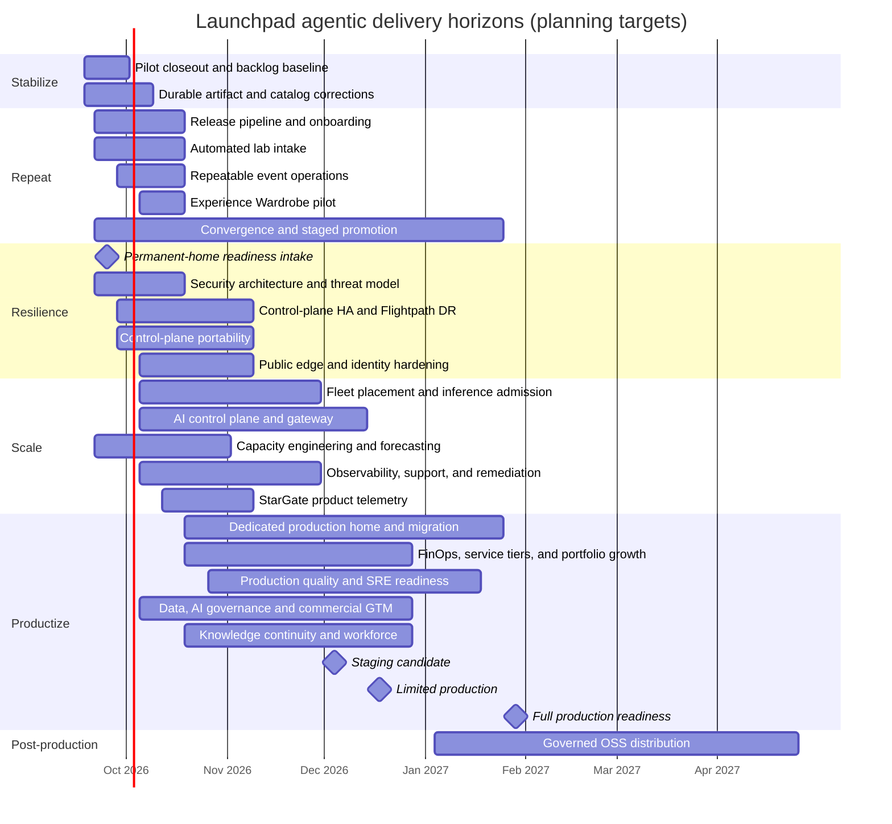

# Launchpad product delivery roadmap

## Purpose

This document translates the target architecture into a sequenced delivery
plan of outcomes, epics, user stories, tasks, dependencies, and evidence gates.
It is the delivery view of
[`ecosystem-architecture-roadmap.md`](ecosystem-architecture-roadmap.md), not a
replacement for that architecture. Active defects and features are tracked in
[`pilot-issue-feature-register-20260917.md`](pilot-issue-feature-register-20260917.md).
The bounded Intel handoff and repository-manifest cleanup sequence is defined in
[`yaml-cleanup-plan.md`](yaml-cleanup-plan.md); that plan does not authorize
changes to active labs or live GitOps sources.

Dates below are planning targets beginning after the September 17, 2026 pilot.
They assume agentic software delivery: multiple bounded implementation,
documentation, test, evidence, and review workstreams proceed in parallel with
human product and operational oversight. They become commitments only after
owners, capacity, infrastructure access, and funding are assigned. Security,
evidence, documentation, observability, and zero-residue cleanup are part of
every increment rather than final hardening phases.

Agentic delivery compresses code discovery, scaffolding, implementation,
refactoring, test generation, documentation, and evidence assembly. It does not
remove elapsed-time gates such as hardware delivery, DNS/certificate approval,
external service ownership, retention windows, node soak, concurrent load,
security acceptance, disaster-recovery drills, or human validation of industry
claims. Estimates therefore state both **build effort** and **proof/decision
latency** rather than treating all elapsed time as typing time.

## Living dashboard

Open the clickable
[`product-roadmap-dashboard.html`](product-roadmap-dashboard.html) for the Gantt,
delivery hierarchy, September 17 pilot postmortem, TDD/EDD/CDD/BDD/CBT matrix,
and 100-point release rubric.
The roadmap Markdown owns scope and schedule;
[`product-roadmap-status.json`](product-roadmap-status.json) owns proof status,
evidence links, and accepted rubric points. The dated
[`september-17-pilot-postmortem.json`](september-17-pilot-postmortem.json)
owns the event snapshot used by the postmortem tab; later reclaim or completion
evidence must append a new snapshot rather than rewriting the observed event.

Record a test result with the status helper rather than hand-editing the HTML:

```bash
python3 scripts/update_product_roadmap_status.py \
  --task LP-T008 \
  --method tdd \
  --stage green-local \
  --evidence evidence/runs/catalog-image-test.json
```

The helper validates the task and evidence path, updates the ledger, and
regenerates the dashboard. Pre-commit refreshes the page when its sources
change, and CI can use `python3 scripts/generate_product_roadmap_dashboard.py
--check` to reject stale output. A declared task remains effectively RED until
all five proof methods have reached its declared stage; production requires all
critical tasks GREEN-live and a 100/100 accepted rubric.

## Delivery hierarchy

- **Outcome:** measurable user or business result delivered by a horizon.
- **Epic (`LP-E###`):** a cross-component capability that may span releases.
- **Story (`LP-S###`):** independently demonstrable user or operator value.
- **Task (`LP-T###`):** implementation or verification work needed by a story.
- **Defect/performance item:** stable `PILOT-BUG-*` or `PILOT-PERF-*` record in
  the issue register.
- **Evidence gate:** objective proof required before the story or epic is done.

A story is not done when its pods are running. It is done when its contract,
functional journey, authorization, failure behavior, observability, cleanup,
documentation, and evidence have passed at the declared scale.

Usability is continuous from pilot through staging and production. Each
parallel stream must preserve the current usable path and supply evidence for
the participant, trainer, requester, administrator, and operator journeys it
affects. A technically healthy component cannot promote while any required
journey is unusable; usability regressions block convergence and trigger the
pivot policy.

## Parallel delivery governance

The execution model is defined in
[`parallel-agentic-delivery.md`](parallel-agentic-delivery.md). Fifteen bounded
vertical streams share versioned contracts, while no more than four
implementation streams begin concurrently. Only the convergence stream may
assemble a release candidate or request an explicitly approved live mutation.

[`delivery-streams-v1.yaml`](../contracts/delivery-streams-v1.yaml) is the
machine-readable ownership, dependency, pivot, and contract authority.
[`convergence-matrix-v1.yaml`](../certification/convergence-matrix-v1.yaml) is
the machine-readable integration and earned-promotion authority. Feature
streams cannot activate catalogs, rotate shared credentials, reclaim retained
sessions, migrate control-plane state, or promote themselves.

## Timeline at a glance



## Promotion milestones

- **Staging candidate milestone:** December 4, 2026 — an immutable candidate
  passes integration, migration, rollback, security, and representative-load
  gates in the permanent-home environment.
- **Limited production milestone:** December 18, 2026 — bounded users and
  catalogs operate under declared SLOs, support ownership, rollback, and DR.
- **Full production readiness milestone:** January 29, 2027 — three consecutive
  production-shaped certifications, independent acceptance, qualified backup
  ownership, and the 100/100 release rubric are complete.

These are accelerated planning targets, not calendar-only commitments. A
missed permanent-home intake, unresolved critical/high security finding,
insufficient service ownership, failed soak or recovery run, or material
contract pivot moves the affected milestone; it never lowers the evidence gate.
Governed OSS distribution remains a parallel post-production deliverable and
does not block the internal production-service milestone.

The accelerated path assumes four bounded implementation streams, a dedicated
product/architecture decision owner, named infrastructure, security, SRE, and
service owners, permanent-home access by September 25, and decisions on blocked
contracts within two business days. It reuses the proven pilot architecture;
a control-plane rewrite, delayed environment, or unstaffed acceptance function
requires an explicit rebaseline.

## Agentic estimation model

These estimates assume three or four coordinated agentic workstreams plus a
dedicated human product/architecture owner, named acceptance owners, and access
to the required environments.
Workstreams share contracts and evidence rather than independently mutating the
same files or clusters.

| Epic | Agentic build estimate | Proof or external gate | Expected elapsed window |
|---|---:|---|---:|
| LP-E001 Pilot closeout | 2–3 agent-days | retention window and event-owner review | 1 week |
| LP-E002 Immediate catalog corrections | 3–5 agent-days | fresh orders and concurrent participant proof | 2–3 weeks |
| LP-E003 Catalog supply pipeline | 5–10 agent-days | registry, signing, ownership and promotion approval | 3–4 weeks |
| LP-E019 Automated lab intake | 5–8 agent-days | source-owner review and generated one-seat certification | 3–4 weeks |
| LP-E004 Repeatable event operations | 4–7 agent-days | three rehearsals and reclaim observation | 3–4 weeks |
| LP-E022 Convergence and earned promotion | 4–8 agent-days | shared-contract freeze, live canaries and human acceptance | continuous; first candidate 3–4 weeks |
| LP-E005 Control-plane HA | 8–15 agent-days | HA infrastructure, failure injection and soak | 4–8 weeks |
| LP-E006 Flightpath DR | 5–10 agent-days | hard fencing plus three timed drills | 3–6 weeks |
| LP-E021 Control-plane portability | 7–12 agent-days | target infrastructure, restore, migration and rollback proof | 4–8 weeks |
| LP-E007 Public identity/edge | 5–10 agent-days | DNS/TLS/security decisions and 25-user browser run | 3–7 weeks |
| LP-E008 Fleet management | 7–12 agent-days | credentials and per-cluster certification | 4–8 weeks |
| LP-E009 AI-serving/admission | 7–15 agent-days | model capacity, exact prompt load and hardware availability | 4–10 weeks |
| LP-E029 AI control plane/gateway | 8–15 agent-days | gateway ownership, security architecture, model-provider contracts, HA and representative load | 6–12 weeks |
| LP-E020 Capacity engineering | 5–10 agent-days | measured cluster/model supply and forecast calibration | 3–8 weeks |
| LP-E010 Operations/observability | 5–10 agent-days | datasource access and injected incident rehearsal | 3–6 weeks |
| LP-E011 Safe remediation | 3–5 agent-days per failure class | authorization, fault and rollback proof per class | continuous |
| LP-E017 StarGate telemetry | 5–10 agent-days | StarGate consumer, retention and security ownership | 3–4 weeks |
| LP-E018 Experience Wardrobe | 4–7 agent-days for pilot | persona/industry SME review and content evaluation | 1–2 weeks pilot; 3–5 weeks productized |
| LP-E012 Production home | 10–20 agent-days | funding, cluster/network delivery, cutover and DR | 3–5 months |
| LP-E013 Security/governance | 7–12 agent-days | independent assessment and remediation acceptance | 4–8 weeks |
| LP-E014 FinOps/service tiers | 5–10 agent-days | finance ownership and telemetry reconciliation | 3–6 weeks |
| LP-E015 Solution portfolio | 3–7 agent-days per solution | solution-owner, data, security and scale review | 2–6 weeks per solution |
| LP-E016 Repository delivery model | 7–15 agent-days, staged | ownership decisions and compatibility soak | 4–8 weeks |
| LP-E023 Production-quality validation | 8–15 agent-days | production-shaped environments, endurance windows and accepted thresholds | 6–12 weeks |
| LP-E024 SRE operating model | 7–12 agent-days | service ownership, paging integration and incident game days | 5–10 weeks |
| LP-E025 Data and AI governance | 7–12 agent-days | privacy, legal, security and responsible-AI acceptance | 6–12 weeks |
| LP-E026 Product, GTM and customer success | 8–15 agent-days | sales/CRM ownership, consent, packaging and field validation | 8–16 weeks |
| LP-E027 Organizational readiness | 7–12 agent-days | secondary owners, training time and non-author continuity drills | 6–12 weeks |
| LP-E028 Governed OSS distribution | 8–15 agent-days | legal, brand, security, maintainer and public-release acceptance | 8–16 weeks |

Agent-days are not added to produce the calendar because the roadmap deliberately
overlaps independent epics. The critical path is usually the longest proof or
external-decision gate, not the sum of generated code tasks.

## Horizon 0 — Stabilize and close the pilot

**Target:** September 18–October 9, 2026
**Outcome:** preserve the event record, reclaim safely, and turn every observed
failure into a reproducible backlog item rather than carrying live patches
forward as product behavior.

### LP-E001 — Pilot evidence and lifecycle closeout

**LP-S001 — As an event owner, I can see an immutable result for every workshop
wave so that success, degradation, and failure are not anecdotal.**

- `LP-T001` Capture order, workshop, seat, cluster, catalog revision, model,
  image digest, timestamps, validation, incident, and support data.
- `LP-T002` Run workshop-scoped reclaim after the approved retention window.
- `LP-T003` Verify zero namespaces, Routes, RoleBindings, Argo applications,
  entitlements, model keys, capacity reservations, and orphan records.
- `LP-T004` Publish a signed/hashable evidence manifest and event retrospective.
- **Gate:** all 270 prepared seats have an explained terminal state; retained
  participant access follows policy; reclaim evidence shows zero residue.

**LP-S002 — As a product owner, I have one prioritized backlog linked to pilot
evidence.**

- `LP-T005` Triage every `PILOT-BUG`, `PILOT-PERF`, and `PILOT-FEAT` item.
- `LP-T006` Assign owner, severity, target release, dependency, and proof plan.
- `LP-T007` Add a failing regression test before implementing each defect fix.
- **Gate:** no S0/S1 issue lacks an owner, reproduction, and target horizon.

**LP-S020 — As an operator, I can account for every retained seat and observe
the complete reclaim lifecycle without deleting active work prematurely.**

- `LP-T069` Reconcile workshop/session records with namespaces and resources on
  each persisted execution cluster; report missing records and orphans.
- `LP-T070` Capture claims, creation, expiration, readiness, routes, restarts,
  model dependencies, resource counts, and known risk for every retained
  workshop.
- `LP-T071` At an explicitly approved reclaim window, record every lifecycle
  transition and owned-resource deletion milestone through zero residue.
- `LP-T072` Publish the reclaim duration, failures/retries, residue checks,
  capacity release, audit trail, and evidence hashes without storing secrets or
  participant PII.
- **Gate:** the inventory balances before reclaim; the approved canary and every
  later workshop reach an explained terminal state with zero residue; unrelated
  workshops remain healthy.

### LP-E002 — Immediate catalog corrections

**LP-S003 — As a participant, each promoted lab starts with the correct images,
model, trust, content, and persistent state.**

- `LP-T008` Replace all execution-cluster registry references with approved
  immutable Quay/HA-registry digests. **GREEN-local:** the three pilot catalogs
  now have a fail-closed artifact policy and machine-readable report covering
  immutable Showroom commits and five pinned images; signature, SBOM,
  organization-owned registry, cold-pull, and fresh-seat proof remain open.
- `LP-T009` mount the trusted model CA and remove global TLS verification
  bypasses.
- `LP-T010` Persist AnythingLLM state and make initialization idempotent.
- `LP-T011` Declare tool-calling/model capability requirements in the catalog.
- `LP-T012` Correct the final-synthesis prompt and token budgets for Building an
  AI Agent.
- `LP-T084` Fix Multi-Agent participant UI authentication so agent discovery and
  workflow streaming use the same protected client; distinguish discovery,
  workflow, model, and tool failures in the UI and logs.
- **Gate:** fixes for `PILOT-BUG-001` through `004`, `PILOT-BUG-013`, and
  `PILOT-PERF-001` pass a fresh 1-seat order, restart recovery, functional
  journey, and reclaim.

## Horizon 1 — Make events repeatable

**Target:** September 21–October 23, 2026
**Outcome:** a content owner can promote a catalog release and an operator can
run the same event again without manual image copying or seat mutation.

### LP-E003 — Catalog release and software-supply pipeline

**LP-S004 — As a content owner, I can promote a tested catalog revision without
editing the live environment.**

- `LP-T013` Define the catalog package contract: source commit, Showroom build,
  deployment manifests, image digests, model capabilities, journeys, resource
  envelope, cleanup, and supported targets.
- `LP-T014` Build, scan, generate SBOM, sign, and attest images and content.
- `LP-T015` Add test → approval → production promotion with immutable release
  identity and rollback metadata.
- `LP-T016` Show the exact release identity in requester, participant, and admin
  views.
- `LP-T017` Block promotion when a cross-cluster image, mutable tag, secret, or
  unsupported model is detected. **GREEN-local (artifact subset):** CI and the
  local `catalog-artifacts` gate reject mutable, unapproved, missing, and
  execution-cluster-local image references and retain a JSON receipt. Secret,
  model-compatibility, signature, SBOM, and deployed pullability gates remain.
- **Gate:** one quickstart repository enters through the pipeline and reaches a
  production catalog without a bespoke platform edit.

**LP-S005 — As an operator, I know artifacts will be available before accepting
an order.**

- `LP-T018` Select the durable HA registry/content origin and retention policy.
  **GREEN-local:** Quay is the provisional authoritative origin with dedicated
  component repositories, scoped credential roles, retention guards, and a
  fail-closed contract gate. Organization ownership, repository grants,
  signing, restore, and destination cold-pull evidence remain open.
- `LP-T019` Add destination pull, certificate, architecture, signature, and
  cold-cache checks to eligibility. **GREEN-local:** a versioned, fail-closed
  destination receipt contract and evaluator now require evidence for every
  check; authentic per-cluster integration and live receipts remain open.
- `LP-T020` Pre-pull scheduled-event releases and report cache/mirror status.
  **GREEN-local:** a versioned immutable plan deduplicates exact images per
  assigned cluster, and cache receipts fail closed unless every image proves
  full-node coverage, digest/signature verification, and source attribution.
  Actual pulls and live cache-loss recovery remain open.
- **Gate:** cold-node and registry-restart tests succeed on every certified
  execution cluster.

### LP-E019 — Automated lab intake and certification

**LP-S025 — As a solution owner, I can submit one immutable quickstart
repository and receive a safe, reviewable, certified catalog draft.**

- `LP-T096` Add a self-service intake API and admin workflow for repository,
  immutable revision, owner, audience, duration, lab type, and expected scale.
  **GREEN-integration (draft workflow slice):** the authenticated admin
  contract accepts a pinned canonical Quickstart repository plus Launchpad
  hints, returns a content-addressed draft, persists it durably in PostgreSQL,
  and exposes repo-first list, submit, detail, and gated-pipeline views. Four
  concurrent service instances converged on one draft in disposable PostgreSQL.
  Repository discovery execution and promotion remain disabled and open.
- `LP-T097` Discover Antora content, manifests, Containerfiles, images, models,
  Operators, ports, storage, secrets, resource envelopes, and cleanup behavior.
  **GREEN-live-partial (isolated worker slice):** immutable repository discovery now
  has a credential-free executable worker, complete-source secret scanning,
  sanitized receipts, deterministic draft output, and mandatory cleanup. A
  generated OpenShift Job/NetworkPolicy is non-root, read-only, tokenless,
  bounded, ephemeral, and restricted to DNS plus an allowlisting egress proxy.
  A durable, fail-closed dispatcher/collector contract now tracks queued,
  running, failed, and completed discovery attempts behind separate source
  approval. Arena live proof now confirms tokenless/read-only execution,
  bounded cleanup, DNS plus allowlisted-proxy egress, and denial of direct
  GitHub, Kubernetes API, and production PostgreSQL access. Real Quickstarts
  failed closed on source scanning or the canonical Antora contract without
  emitting a catalog draft. The default dispatcher remains disabled; signed
  external image publication, deployed receipt collection, one passing
  canonical repository, and remaining live fault proof are open.
- `LP-T098` Generate the catalog record, deployment package, functional
  journey, certification contract, ownership record, and initial support plan.
  **GREEN-local (catalog-draft slice):** a versioned immutable discovery
  receipt deterministically generates and persists the reviewable catalog
  draft. The admin journey now shows its discovery proof, cleanup result,
  capabilities, generated metadata, and remaining blockers. Deployment package,
  participant journey, ownership, support, and complete certification remain
  open.
- `LP-T099` Default generated entries to draft, internal-only, and one-seat;
  fail closed on ambiguous, privileged, mutable, or unsupported requirements.
  **GREEN-local:** draft generation enforces draft status, internal-only
  exposure, a one-seat ceiling, immutable matching sources, unchanged
  inventory, and unresolved blockers; broader unsupported-requirement policy
  remains open.
- `LP-T100` Run source, content, artifact, security, model, one-seat lifecycle,
  restart, and zero-residue reclaim gates without editing a live catalog.
  **GREEN-live-partial (worker-safety contract):** a versioned fail-closed boundary now
  defines immutable approved sources, default-deny egress, credential denial,
  non-root/read-only execution, bounded resources, three-stage secret scanning,
  sanitized evidence, cleanup receipts, idempotency, and an explicit ban on
  live mutations. Arena now proves runtime isolation and egress enforcement in
  a dedicated non-production namespace. Payload/source/output scanning, stable
  idempotency, sanitized failure codes, cleanup receipts, and the restricted
  Job contract have component and partial live proof. Arena fault injection now
  proves sanitized scanner failure with a passing cleanup receipt, and proves
  timeout/cancellation remove their pods and ephemeral volumes. Bounded retry
  is GREEN-local and requires a verified cleanup receipt, preserves the stable
  idempotency key, and rejects scanner or policy failures. Forced termination
  still cannot produce the required trusted zero-residue receipt; deployed
  retry recovery, signing/SBOM, a trusted collector, and one fully passing
  canonical repository remain open. Release eligibility stays false and the
  admin action remains off.
- `LP-T101` Present blockers, evidence, supported targets, scale ceiling,
  release identity, approval history, and rollback metadata in the admin UI.
  **GREEN-integration (draft visibility):** draft responses and the admin Intake
  screens expose these fields, the durable storage scope, and the full gated
  pipeline. A completed discovery advances the view to catalog-draft review
  while source approval and discovery controls appear only when their durable
  preconditions pass. Certification, approval, and promotion remain locked.
- **Gate:** a new quickstart progresses from immutable repository revision to a
  certified draft and approved promotion without a bespoke platform code edit.

### LP-E022 — Parallel convergence and earned promotion

**LP-S028 — As the product owner, independently developed streams converge on
one compatible candidate that earns each release stage through evidence.**

- `LP-T114` Version the parallel-stream ownership, dependency, entry/exit gate,
  prohibited-mutation, and work-in-progress contract.
- `LP-T115` Maintain one shared-contract registry with owner, consumers,
  version, compatibility window, and repository authority.
- `LP-T116` Maintain a machine-readable convergence matrix joining TDD, EDD,
  CDD, BDD, CBT, security, capacity, fault, rollback, and cleanup evidence.
- `LP-T117` Record stream-local, contract, product/capacity, and emergency/live
  pivots without rewriting completed evidence or the active candidate.
- `LP-T118` Fail CI on ownership conflicts, unknown or cyclic dependencies,
  illegal live-mutation authority, missing evidence, or unsupported green
  claims.
- `LP-T119` Promote one unchanged signed candidate through local, integration,
  canary, staging, limited-production, and production gates with human
  acceptance and tested rollback.
- **Gate:** a candidate cannot skip a stage or self-promote; every accepted
  stage has compatible contracts and complete linked evidence.

### LP-E004 — Repeatable event orchestration

**LP-S006 — As an instructor, I can schedule, launch, monitor, and reclaim an
event using a single workflow.**

- `LP-T021` Add a versioned, jointly approved event manifest containing
  cohorts, participants per cohort, labs per participant, retention, exposure,
  staggered order windows, workshop-level status, certified execution
  capacity, DR-reserved capacity, and uncertified capacity. Calculate total
  seat-environments as the sum of `cohort participants × labs assigned`; never
  infer it from participant count alone.
- `LP-T022` Add bounded seat waves, durable/fenced lifecycle jobs, retry budgets,
  and bulk reclaim.
- `LP-T023` Produce instructor links/codes, readiness estimates, seat claims,
  support state, and evidence from the event record.
- `LP-T024` Automate the exact documented journey at 1, 5, then 25/30 seats.
- **Gate:** three consecutive current-release rehearsals meet the catalog ×
  cluster × exposure SLO and reclaim with zero residue.

### LP-E018 — Agentic Experience Wardrobe

**LP-S023 — As an instructor, I can choose a curated persona and industry lens
for a workshop without creating another infrastructure implementation.**

- `LP-T085` Define a versioned `experience_profile` contract containing persona,
  industry, depth, objective, scenario, content modules, prompts, sample data,
  checkpoints, deliverables, compatibility, and evidence requirements.
- `LP-T086` Persist the default and allowed profiles on the workshop and the
  selected profile on the participant entitlement/seat.
- `LP-T087` Add instructor defaults and participant selection/resume while
  preserving one stable lab URL and identity session.
- `LP-T088` Render profile-specific Showroom navigation, language, examples,
  prompts, datasets, business outcomes, and leave-behind assets from the same
  certified runtime release.
- `LP-T089` Treat any profile that changes Operators, RBAC, models, storage,
  networking, resource envelope, or data policy as a separately certified
  catalog profile rather than a content wardrobe.
- **Gate:** one lab supports at least three curated profiles, switching content
  does not restart the lab, resume preserves the selected profile, and runtime
  isolation/capacity evidence remains unchanged.

**LP-S024 — As a content owner, I can use agentic AI to generate and maintain
wardrobe content without publishing unsupported industry claims or divergent
instructions.**

- `LP-T090` Create a retrieval-grounded generation workflow using approved core
  lab facts, brand guidance, persona outcomes, vertical vocabulary, and source
  citations.
- `LP-T091` Generate profile modules, prompts, sample data, checkpoints,
  accessibility text, instructor notes, and evaluation cases as reviewable Git
  changes—not direct production mutations.
- `LP-T092` Add automated structural, link, command, expected-output, terminology,
  hallucination, sensitive-data, accessibility, and brand checks.
- `LP-T093` Require named human SME approval for regulated, safety-sensitive,
  performance, financial, healthcare, public-sector, or product claims.
- `LP-T094` Measure completion, confusion, failure, model usage, and business
  outcome by bounded `experience_profile`; never use participant identity as a
  metric label.
- **Gate:** every published profile has source provenance, reviewer identity,
  content/evaluation results, participant-journey evidence, and rollback to the
  core/default experience.

## Horizon 2 — Resilient control plane and public access

**Target:** September 21–November 13, 2026
**Outcome:** a worker, connector, API pod, or active-site failure does not create
ambiguous lifecycle state or strand participants.

### LP-E005 — Control-plane high availability

**LP-S007 — As an operator, the control plane remains transactional when one
eligible worker or stateless replica fails.**

- `LP-T025` Externalize process-local state and run stateless API, portal,
  gateway, and lifecycle workers across failure domains.
- `LP-T026` Deploy HA PostgreSQL, durable queues/leases, fencing, backups, and
  tested restore.
- `LP-T027` Remove hostname pins and separate control-plane capacity from seat
  bursts.
- `LP-T028` Make health require database, queue, identity, placement, model, and
  participant authorization—not edge HTTP alone.
- **Gate:** worker and pod fault injection preserves accepted lifecycle work and
  stays within the agreed RPO/RTO.

### LP-E006 — Fenced Flightpath disaster recovery

**LP-S008 — As an incident commander, I can promote Flightpath and fail back
without split brain or retargeting active cleanup.**

- `LP-T029` Automate immutable backup replication and recovery-state reporting.
- `LP-T030` Implement hard fencing, GitOps ownership transfer, public-edge and
  identity recovery, restore validation, and failback.
- `LP-T031` Execute three consecutive disaster-recovery drills.
- **Gate:** five-minute RPO and fifteen-minute RTO are demonstrated, all active
  `cluster_ref` values remain correct, and audit/evidence is complete.

### LP-E021 — Control-plane portability and production-home promotion

**LP-S027 — As the service owner, I can install, restore, migrate, and roll back
Launchpad on a candidate home without rebuilding state manually.**

- `LP-T108` Define portable prerequisites for compute, storage, database,
  identity, registry, GitOps, secrets, edge, observability, and execution-cluster
  connectivity without naming an implicit execution-cluster authority.
- `LP-T109` Produce a declarative clean bootstrap from immutable releases and
  approved out-of-band secrets.
- `LP-T110` Version and test backup, restore, schema migration, identity realm,
  catalog, policy, evidence, and cluster-registry recovery.
- `LP-T111` Reconcile in-flight workshops, sessions, entitlements,
  reservations, and persisted `cluster_ref` values after restore or migration.
- `LP-T112` Automate edge cutover, prior-plane fencing, health validation,
  rollback, and failback without split brain.
- `LP-T113` Certify clean install, restore, migration, rollback, and complete
  reclaim before a candidate home may be called staging or production.
- `LP-T182` On receipt of the permanent-home environment, run a fail-closed
  readiness intake covering hardware and failure domains, OpenShift version,
  storage, registry, DNS/TLS, ingress/egress, identity, secrets, backup,
  observability, ownership, support, and execution-cluster connectivity.
- **Gate:** an empty approved target can become the authoritative control plane,
  continue or safely reconcile existing work, and return to the prior plane
  within the declared RPO/RTO using unchanged signed artifacts.

**Planning dependency:** the permanent home is expected late next week,
provisionally September 24–25, 2026. Delivery of infrastructure is not proof of
readiness and does not authorize migration. `LP-T182` must publish the accepted
gaps and evidence before bootstrap, restore, or cutover work begins.

### LP-E007 — Highly available public identity and edge

**LP-S009 — As a participant, I can claim and resume my labs through one stable
entry point during a connector or worker failure.**

- `LP-T032` Run multiple tunnel/edge connectors with topology spread, PDBs, and
  route-aware health.
- `LP-T033` Harden Keycloak, entitlement gateway, code rotation, session
  revocation, rate limiting, and identity cleanup.
- `LP-T034` Certify Showroom, proxied tools, workspace, namespace-scoped Console,
  add-lab, my-labs, logout, and re-entry paths.
- `LP-T035` Decide the long-term public DNS/TLS/WAF architecture and migration
  from the pilot tunnel.
- **Gate:** 25 simultaneous claims meet the latency/error SLO; connector and
  worker failure do not break an established participant journey.

## Horizon 3 — Intelligent fleet scale and operations

**Target:** September 21–December 18, 2026
**Outcome:** Launchpad places complete workshops using measured cluster,
artifact, and inference capacity and operates them with actionable evidence.

### LP-E008 — Heterogeneous execution-fleet management

**LP-S010 — As a requester, my whole workshop is placed on an eligible cluster
with a clear capacity explanation.**

- `LP-T036` Version cluster profiles, capabilities, credentials, storage,
  ingress, exposure, model, artifact, and certification facts.
- `LP-T037` Reserve aggregate CPU, memory, pods, storage, route, and model
  capacity atomically before provisioning.
- `LP-T038` Rank only eligible clusters and persist inputs, rejections, score,
  policy version, and selected `cluster_ref`.
- `LP-T039` Add drain, maintenance, quarantine, requalification, and retirement
  workflows.
- **Gate:** concurrent orders never overbook or split a workshop; create,
  validation, expiry, and reclaim touch only the persisted cluster.

**LP-S011 — As a product owner, I can choose the justified deployment class for
each lab.**

- `LP-T040` Add shared namespace, dedicated workshop cluster, and exceptional
  dedicated seat cluster to the catalog contract.
- `LP-T041` Score labs through the security, operator, data, networking,
  performance, isolation, cost, and teardown rubric.
- `LP-T042` Integrate cluster provisioning beneath Launchpad only for forecasted
  or justified dedicated capacity.
- **Gate:** each promoted catalog records its deployment-class decision and
  evidence; ordinary namespace labs do not create clusters per seat.

### LP-E009 — Governed AI-serving and semantic routing plane

**LP-S012 — As a requester, my catalog is admitted only when compatible model
capacity is available.**

- `LP-T043` Publish model capabilities, versions, context/tool support, trust,
  rate limits, health, and cost.
- `LP-T044` Measure replicas, active/queued requests, tokens, latency, failures,
  and workshop reservations.
- `LP-T045` Add deterministic inference admission and policy routing; use AI
  only to forecast or recommend among already eligible choices.
- `LP-T046` Support approved CPU, accelerator, and semantic-routing pools
  without exposing model endpoints publicly.
- **Gate:** an intentionally saturated or incompatible model prevents admission
  before seat creation; a compatible order completes its functional load test.

### LP-E029 — Governed AI control plane and gateway

This is intentionally separate from the **Launchpad lifecycle control plane**.
Launchpad owns orders, placement, sessions, access, evidence, and reclaim. The
AI control plane owns governed discovery and consumption of model, embedding,
reranking, tool-calling, and semantic-routing services. Model runtimes remain
replaceable data-plane providers behind the gateway.

**LP-S035 — As a platform and AI-service owner, I can expose one governed AI
gateway contract to every eligible lab without coupling labs to a model runtime
or allowing routing intelligence to bypass policy.**

- `LP-T173` Publish the authority boundary and threat model for the Launchpad
  lifecycle plane, AI control plane, AI gateway, semantic router, model-serving
  pools, tool/MCP services, and evidence consumers.
- `LP-T174` Version the gateway contract for authentication, tenant/workshop/
  seat attribution, OpenAI-compatible APIs, embeddings, reranking, tools,
  streaming, timeouts, retry budgets, errors, idempotency, and audit fields.
- `LP-T175` Build a model and capability registry with immutable provider/model
  versions, health, context and tool support, safety posture, residency,
  hardware class, cost class, and deprecation state.
- `LP-T176` Issue, scope, rotate, and revoke short-lived gateway credentials;
  prevent labs and public routes from receiving upstream provider credentials.
- `LP-T177` Implement deterministic policy routing, quota, admission, fallback,
  and circuit breaking. Semantic/AI decisions may rank already eligible targets
  but cannot create eligibility or override security and capacity policy.
- `LP-T178` Separate gateway, router, registry, and runtime failure domains;
  define HA, degraded-mode, reconciliation, backup/restore, and provider
  failover behavior without losing attribution or double-billing requests.
- `LP-T179` Emit privacy-safe per-request metrics and traces for latency, queue,
  tokens, model/provider, routing reason, retries, failure class, cost/showback,
  workshop, lab, and pseudonymous seat correlation.
- `LP-T180` Enforce prompt/tool/RAG security controls, egress policy, content and
  data-handling policy, rate/abuse limits, immutable audit, and emergency model
  or tool revocation.
- `LP-T181` Certify gateway compatibility and behavior at 1, 5, 30, and
  three-workshop concurrent load, including saturation, long prompts, streaming,
  provider loss, router loss, credential rotation, rollback, and zero cross-
  tenant attribution or authorization failures.
- **Gate:** the unchanged gateway release passes contract, security, functional,
  load, failure, recovery, cost-attribution, and rollback proof against at least
  two replaceable serving providers; Launchpad admission remains authoritative.

### LP-E020 — Capacity engineering, forecasting, and admission

**LP-S026 — As an event and operations owner, I can forecast, reserve, admit,
and reconcile complete event demand across cluster and model supply.**

- `LP-T102` Join cohort demand, labs per participant, retention, provisioning
  waves, catalog envelopes, and deployment class into a versioned forecast.
  **GREEN-local:** the versioned offline reconciliation contract joins the
  September 17 event manifest to its recorded postmortem without inventing
  unavailable operational measurements; live supply and reservation remain
  open.
- `LP-T103` Measure eligible CPU, memory, pods, storage, routes, image
  availability, model replicas, concurrency, tokens, queues, and DR headroom.
- `LP-T104` Reserve cluster and inference supply atomically for the whole
  workshop and reject or queue demand before creating seats when any dimension
  is insufficient. **GREEN-local:** a pure aggregate admission ledger proves
  whole-workshop accept/reject, infrastructure and model envelopes,
  idempotency, and thread-level overbook protection. PostgreSQL serializable
  transactions and advisory locks additionally prove cross-process
  whole-workshop admission, durable rejection, idempotency, and evidence-gated
  release against a disposable database. Production migration, lifecycle
  wiring, and live authoritative supply remain open.
- `LP-T105` Keep deterministic eligibility and admission authoritative; permit
  AI only to forecast or recommend among policy-eligible choices.
- `LP-T106` Reconcile forecast, reservation, provisioned request, actual use,
  reclaim release, latency, and failure data by event, workshop, catalog,
  cluster, model, and seat. **GREEN-local (reservation slice):** accepted and
  rejected decisions retain event/workshop/catalog/cluster/model dimensions,
  while evidence-gated release and capacity-drift reconciliation are proven
  offline. Provisioned, actual-use, latency, and failure joins remain open.
- `LP-T107` Prove concurrent-order protection, maintenance/quarantine behavior,
  model saturation, cache loss, capacity drift, and reservation release.
- **Gate:** three event forecasts remain within the accepted error budget,
  concurrent orders never overbook or split a workshop, and all capacity is
  released and reconciled after reclaim.

### LP-E010 — Operations, observability, and support

**LP-S013 — As an operator, I can identify whether a failure is seat, catalog,
cluster, edge, artifact, MCP, or model related from one console.**

- `LP-T047` Deliver lab/seat cells with state, stage, usage, latency, retries,
  error class, resource pressure, and participant-safe identifiers.
- `LP-T048` Deliver model and cluster views with queue, token, replica, node,
  route, storage, capacity, and reservation data.
- `LP-T049` Add alert ownership, runbook links, incident timelines, evidence
  capture, and backlog linkage.
- `LP-T050` Define service SLOs and support escalation for event and steady use.
- **Gate:** injected failures produce the correct signal, alert, runbook, audit,
  and resolution evidence without relying on unrestricted cluster access.

### LP-E011 — Safe self-service and remediation

**LP-S014 — As an operator, low-risk repeatable failures can be corrected
safely without granting the platform unrestricted mutation authority.**

- `LP-T051` Normalize failure classes and introduce observe → recommend →
  approve → allow-listed automatic execution stages.
- `LP-T052` Start with validation retry, Showroom resync, owned Route recreation,
  failed-seat retry, expiration, and orphan reconciliation.
- `LP-T053` Require immutable target identity, idempotency, retry budgets,
  circuit breakers, post-validation, audit, and escalation.
- **Gate:** every automated action passes fault injection and cannot mutate a
  different tenant, workshop, cluster, or shared infrastructure component.

### LP-E017 — StarGate product telemetry and evidence

**LP-S021 — As StarGate, I receive durable, versioned, privacy-safe lifecycle
evidence so that I can classify failures without becoming the lifecycle source
of truth.**

- `LP-T073` Version the event taxonomy and producer/consumer schema for orders,
  placement, seats, access, artifacts, models, validation, incidents,
  remediation, and reclaim.
- `LP-T074` Add transactionally persisted outbox records, fenced publishers,
  receipts, idempotent consumer handling, bounded retries, dead-letter state,
  and replay.
- `LP-T075` Add correlation, causation, aggregate sequence, `cluster_ref`,
  catalog release, model/artifact dependency, actor, and evidence references.
- `LP-T076` Correct outcome mappings, including `cleanup_failed`, and reject
  unknown or incompatible schemas.
- `LP-T077` Enforce the logging and sensitive-data policy; add delivery, lag,
  coverage, sequence-gap, and failure-class telemetry.
- `LP-T078` Prove StarGate downtime never blocks Launchpad and no accepted
  lifecycle event is lost through restart/network fault tests.
- `LP-T095` Emit privacy-safe `lab.step.started`, `lab.step.executed`, `lab.step.succeeded`, `lab.step.failed`, and `lab.checkpoint.completed` events.
  Correlate stable catalog release, module, step, curated command, workshop,
  seat, and anonymized participant identifiers with outcome, duration,
  timestamp, and execution source. Preserve separate `claimed`,
  `authenticated`, `opened`, `active`, and `completed` journey states. Record
  a stable command ID or content digest for curated Showroom actions, never raw
  terminal commands. Exclude raw prompts, responses, documents, codes,
  secrets, and email from analytical evidence; never infer execution or
  completion from a button click, claim, route request, or authorization check.
- **Gate:** 1-seat, 5-seat, and certified-scale runs have complete ordered
  receipts and reclaim evidence with zero secrets/PII in logs or metrics.

**LP-S022 — As a product or operations owner, I can see StarGate in the product
list with truthful health, maturity, coverage, and evidence.**

- `LP-T079` Define the bounded StarGate product-summary API and UI contract.
- `LP-T080` Show owner, version, supported schemas/events, health, last receipt,
  consumer lag, queued-event age, capability maturity, coverage, and evidence.
- `LP-T081` Mark evidence, preflight, classification, recommendation, approved
  execution, and automatic execution as separate maturity states.
- `LP-T082` Require a recent synthetic event round trip; do not infer health
  from Route or pod readiness alone.
- `LP-T083` Add alerts, runbook, support ownership, retention, access control,
  and incident workflow.
- **Gate:** the product list degrades accurately under producer, delivery,
  consumer, storage, and schema faults and never exposes protected identifiers.

## Horizon 4 — Production service and portfolio

**Target:** October 5, 2026–January 29, 2027
**Outcome:** Launchpad runs from a funded, supported production home with a
portable execution fleet, governed solution portfolio, production-quality and
SRE evidence, privacy-safe GTM intelligence, customer-success ownership, and
transparent cost and value. Production operation no longer depends on one
person.

### LP-E012 — Dedicated production home and migration

**LP-S015 — As the service owner, I can operate Launchpad independently from
participant execution clusters.**

- `LP-T054` Approve owner, funding, support model, network/security boundary,
  production control-plane cluster, and separate recovery site.
- `LP-T055` Deploy the HA control, identity, policy, GitOps, evidence, registry,
  observability, and data services through repeatable automation.
- `LP-T056` Migrate state and public entry points using rehearsed cutover and
  rollback; retain Arena, Brutus, Flightpath, and future clusters as certified
  execution targets where appropriate.
- **Gate:** production readiness review, migration drill, DR drill, security
  assessment, operational acceptance, and rollback all pass.

### LP-E013 — Security, governance, and compliance

**LP-S016 — As a security owner, I can prove identity, tenant isolation,
software provenance, secret hygiene, and accountable mutation.**

- `LP-T057` Threat-model public access, control plane, execution fleet, model
  plane, artifact supply, data flow, and support access. **GREEN-local:** the
  versioned repository-owned model validates seven surfaces, trust boundaries,
  assets, controls, threats, verification evidence, ownership, and unresolved
  risk gates. Six high risks and five planned verifications correctly block
  release.
- `LP-T058` Enforce least privilege, credential rotation, secret scanning,
  policy-as-code, signing/verification, audit retention, and incident response.
  **GREEN-local (session-response slice):** session APIs now use a dedicated
  secret-free response contract across requester, participant, lifecycle, and
  admin paths. Rotation, signing, live policy enforcement, and abuse testing
  remain open. **GREEN-local (audit slice):** a versioned audit-integrity and
  retention contract now defines accountable events, recursive redaction,
  separated roles, retention classes, tamper-evident chaining/anchors, governed
  exports, disposition receipts, and legal holds. Durable enforcement remains
  release-blocking.
- `LP-T059` Run cross-seat, cross-tenant, cross-cluster, expired-entitlement,
  supply-chain, and recovery abuse tests.
- **Gate:** zero critical/high findings and complete corrective evidence for the
  production release.

### LP-E014 — FinOps, showback, and service tiers

**LP-S017 — As a business owner, I can understand and allocate the cost and
value of each catalog, workshop, tenant, cluster, and model.**

- `LP-T060` Meter reserved and consumed CPU, memory, storage, network, artifact,
  model tokens/time, support, and idle-retention cost.
- `LP-T061` Define rate cards, budgets, quotas, showback, chargeback, and cost
  anomaly policy without exposing participant-sensitive data.
- `LP-T062` Publish service tiers for pilots, workshops, extended labs, and
  dedicated environments with explicit SLOs and evidence.
- **Gate:** measured invoice/showback totals reconcile to infrastructure and
  model telemetry for a complete event.

### LP-E015 — Governed solution portfolio

**LP-S018 — As a solution team, I can onboard DeepField, StarGate, GeoLux/GCL,
and future experiences through the same contracts.**

- `LP-T063` Assign repository, release, data, security, operations, and support
  ownership per solution.
- `LP-T064` Reuse catalog intake and certification instead of embedding solution
  control planes in every seat.
- `LP-T065` Integrate shared validation, observability, semantic routing, and
  governed remediation only through versioned APIs and scoped evidence.
- **Gate:** each solution passes the same deployment-class, security,
  participant-journey, load, reclaim, and support gates as existing catalogs.

### LP-E023 — Production-quality validation

**LP-S029 — As the release owner, I can prove an unchanged candidate remains
usable, secure, observable, recoverable, and correct under production-shaped
load, failure, and change.**

- `LP-T120` Version service profiles containing supported scale, workload mix,
  latency, throughput, error, saturation, recovery, cleanup, and usability
  thresholds for each service tier.
- `LP-T121` Build reproducible baseline, load, spike, stress, endurance, and
  soak suites for participant, instructor, requester, administrator, operator,
  model, and lifecycle journeys.
- `LP-T122` Exercise simultaneous provisioning, claiming, active lab/model use,
  expiration, and reclaim without overbooking, cross-seat access, or lost work.
- `LP-T123` Inject worker, replica, route, storage, model, registry, identity,
  dependency, network, and control-plane faults while the supported workload is
  active; measure degradation and recovery against SLOs.
- `LP-T124` Prove rolling upgrade, API compatibility, database migration,
  active-session continuity, rollback, and failback using the same candidate
  identity and reconciled authoritative state.
- `LP-T125` Certify supported browsers, devices, viewport sizes, keyboard and
  screen-reader accessibility, redirects, downloads, terminals, Showroom tools,
  and OpenShift access.
- `LP-T126` Reconcile orders, reservations, seats, entitlements, namespaces,
  artifacts, model keys, lifecycle events, costs, and cleanup before and after
  every failure or change test.
- `LP-T127` Publish immutable production-readiness evidence with thresholds,
  measurements, faults, recovery, usability acceptance, findings, residue, and
  the exact tested rollback identity.
- **Gate:** three consecutive production-shaped certifications meet every
  declared threshold with zero critical/high findings, zero duplicate or
  cross-tenant access, reconciled data, successful rollback, and zero residue.

### LP-E024 — SRE operating model and service management

**LP-S030 — As the service owner, I can operate Launchpad through measurable
service levels, actionable telemetry, owned incidents, and sustainable support.**

- `LP-T128` Define versioned SLIs, SLOs, error budgets, burn-rate policy, and
  release-health rules for order acceptance, seat readiness, claim, participant
  journey, model request, reclaim, and recovery.
- `LP-T129` Run continuous participant-facing synthetic journeys for internal
  order/reclaim, public claim/resume, Showroom/workspace/model use, and admin
  diagnosis; never substitute pod readiness for user availability.
- `LP-T130` Deliver dashboards and actionable alerts joining service level,
  seat, lab, model, cluster, edge, dependency, release, and business-impact
  signals with bounded cardinality.
- `LP-T131` Establish severity, paging, escalation, incident-command, backup
  coverage, retry/circuit-breaker, and emergency-change policies.
- `LP-T132` Add stakeholder/status communication, participant-impact timeline,
  mitigation, recovery, evidence capture, post-incident review, and recurrence
  tracking.
- `LP-T133` Govern telemetry schemas, labels, completeness, freshness,
  retention, access, privacy, redaction, sampling, and observability cost.
- `LP-T134` Assign the service owner, on-call roster, support boundary,
  runbook/escalation owners, external dependency owners, maintenance windows,
  and capacity-procurement path.
- `LP-T135` Run operational game days covering event pressure, dependency
  degradation, exhausted error budget, failover, rollback, communication, and
  support handoff.
- **Gate:** synthetic failures produce the correct SLI impact, alert, owner,
  runbook, communication, recovery, audit, and post-incident action within the
  declared service levels; exhausted error budgets block normal promotion.

### LP-E025 — Data, AI, legal, and responsible-use governance

**LP-S031 — As the security and governance owner, I can prove every collected
datum, analytical use, model, tool, artifact, and published claim is permitted,
bounded, reviewable, and removable.**

- `LP-T136` Inventory and classify participant, identity, operational, model,
  prompt, document, sales, support, and financial data with a declared owner,
  purpose, system of record, and permitted consumers.
- `LP-T137` Implement purpose-bound consent and notice for product analytics,
  repeat engagement, and sales attribution while keeping service delivery
  independent of optional commercial consent.
- `LP-T138` Enforce retention, deletion, correction, export, anonymization or
  pseudonymization, backup expiry, legal hold, and geographic handling rules.
- `LP-T139` Prevent secrets, codes, raw email, prompts, responses, and uploaded
  documents from entering telemetry or analytics without an explicit approved
  purpose and access boundary.
- `LP-T140` Version model, prompt, tool, and evaluation records; test quality,
  safety, bias where applicable, drift, provider behavior, deprecation, and
  rollback against catalog learning and business outcomes.
- `LP-T141` Test prompt injection, data exfiltration, unsafe tool use, poisoned
  retrieval, cross-seat context, excessive agency, and material recommendation
  approval boundaries.
- `LP-T142` Review OSS licenses, SBOM/provenance, trademarks, brand use,
  datasets/content rights, provider terms, acceptable use, export controls, and
  privacy/terms notices.
- `LP-T143` Publish a signed governance decision with accepted risks,
  remediations, expiration, approvers, and evidence for each production release.
- **Gate:** unknown purpose blocks collection; missing consent blocks identity
  joins; unapproved models, datasets, claims, or critical/high findings block
  promotion, and an end-to-end deletion test leaves only required audit proof.

### LP-E026 — Product, go-to-market, sales enablement, and customer success

**LP-S032 — As a product and field leader, I can turn privacy-safe Launchpad
evidence into validated solution plays, measurable adoption, responsible sales
influence, and a closed product-feedback loop.**

- `LP-T144` Version campaign, event, workshop, catalog release, pseudonymous
  participant, solution play, account, and opportunity identifiers with named
  systems of record and owners.
- `LP-T145` Instrument invited, registered, claimed, opened, active, checkpoint,
  completed, follow-up, POC, accepted influence, and final outcome as distinct
  states; never infer completion from access or execution from a click.
- `LP-T146` Define a consented, purpose-bound CRM/account/opportunity connector
  that keeps raw email out of analytical events and cannot alter lifecycle or
  authorization state.
- `LP-T147` Implement transparent multi-touch attribution that separates
  observed correlation, accepted influence, sourced opportunity, and revenue;
  require opportunity-owner acceptance for commercial influence.
- `LP-T148` Report adoption, completion, repeat engagement, workload demand,
  seller friction, customer objections, model/hardware fit, cost, support, and
  candidate solution patterns by approved aggregation level.
- `LP-T149` Convert repeatedly successful patterns into governed reference
  architectures, solution recipes, validated sales plays, demos, sizing
  guidance, evidence, talk tracks, and objection handling.
- `LP-T150` Define audience, packaging, pricing or internal service tier,
  entitlement, support boundary, success criteria, and lifecycle policy for
  each promoted solution play.
- `LP-T151` Establish customer-success follow-up, lab resume, POC handoff,
  adoption review, feedback capture, and outcome closure with accountable owners.
- `LP-T152` Feed aggregated demand, failures, overrides, objections, and outcomes
  into product discovery, catalog prioritization, architecture decisions,
  enablement content, and roadmap pivots.
- `LP-T153` Require sales, product, finance, privacy, legal, brand, and solution
  owner approval before publishing claims; retain the supporting evidence and
  expiry date.
- **Gate:** one solution play traces consented activity through completion,
  follow-up, accepted opportunity influence, cost, field feedback, and roadmap
  action without exposing participant identity or claiming unsupported revenue.

### LP-E027 — Organizational readiness and knowledge continuity

**LP-S033 — As the service owner, I can prove Launchpad can be developed,
operated, supported, recovered, and taught without depending on one person.**

- `LP-T154` Inventory critical product, architecture, development, SRE,
  security, content, support, incident-command, sales-enablement, and
  customer-success capabilities with decision authority and access needs.
- `LP-T155` Assign named primary and secondary owners for every critical
  capability, repository, service, contract, runbook, dependency, and release
  decision; identify and prioritize every remaining single-person dependency.
- `LP-T156` Build role-specific learn → shadow → supervised → independent →
  trainer curricula with practical qualification evidence rather than
  attendance-only completion.
- `LP-T157` Create a clean onboarding and offboarding path for development
  environment, repository, cluster, identity, secrets, observability, support,
  and release access without copying personal credentials.
- `LP-T158` Make architecture decisions, operating rationale, contracts,
  runbooks, incident reviews, certification evidence, product decisions, and
  approved sales playbooks versioned, searchable, owned, and freshness-scored.
- `LP-T159` Require qualified non-authors to perform clean bootstrap, catalog
  onboarding, event operation, incident diagnosis, upgrade/rollback,
  backup/restore/failover, and complete reclaim drills.
- `LP-T160` Define hiring profiles, proficiency levels, staffing and on-call
  coverage, succession, contractor/vendor boundaries, and the funded team
  required for each service tier.
- `LP-T161` Establish documentation and training SLIs for freshness, coverage,
  failed searches, unresolved questions, qualification throughput, and
  knowledge concentration.
- `LP-T162` Build and evaluate a role-aware Launchpad Knowledge Assistant over
  approved sources with citations, version/freshness disclosure, access
  control, no secrets or participant data, abstention, and no mutation
  authority.
- **Gate:** every production-critical capability has a qualified secondary;
  one non-author independently completes deployment, operation, incident,
  upgrade, restore, and reclaim scenarios within service objectives, and the
  Knowledge Assistant passes its grounded-answer/security evaluation.

## Horizon 5 — Governed distribution and repository evolution

**Target:** January 4–April 30, 2027
**Outcome:** the proven internal service can be distributed and evolved without
exposing restricted assets, splitting into incompatible products, or coupling
component releases unnecessarily. This horizon does not block internal
production readiness.

### LP-E028 — Governed open-source distribution

**LP-S034 — As a maintainer, I can publish and sustain a useful OSS Launchpad
distribution without exposing internal information, restricted assets, or
creating an incompatible enterprise fork.**

- `LP-T163` Define the public core, private/internal configuration, proprietary
  integrations, enterprise extensions, content, evidence, and brand boundaries
  before moving or deleting files.
- `LP-T164` Perform working-tree and history-aware secret, credential,
  hostname, participant-data, customer-data, confidential-document, and
  generated-evidence review with an approved remediation plan.
- `LP-T165` Replace or exclude restricted Red Hat, Intel, partner, customer,
  event, and third-party assets while retaining neutral extension points and
  clearly licensed example content.
- `LP-T166` Select the project license; produce dependency/license
  compatibility, attribution/notices, SBOM, provenance, signed source and
  artifacts, and content/model/dataset rights evidence.
- `LP-T167` Deliver a clean-checkout reproducible build and neutral local
  reference environment with synthetic data, safe defaults, no internal
  cluster assumptions, and an automated smoke journey.
- `LP-T168` Publish architecture, installation, API/extension, catalog-author,
  operator, contributor, and troubleshooting documentation for a person without
  access to internal systems.
- `LP-T169` Establish maintainer governance, contribution policy, DCO or CLA
  decision, code of conduct, issue/decision process, roadmap boundary, and
  community versus enterprise support expectations.
- `LP-T170` Publish `SECURITY.md`, private vulnerability reporting, supported
  versions, coordinated disclosure, dependency response, release signing, and
  CVE/remediation policy.
- `LP-T171` Version public APIs and extensions; test OSS-to-enterprise catalog,
  contract, upgrade, migration, and rollback compatibility so the products do
  not become unrelated forks.
- `LP-T172` Produce an immutable OSS release review containing sanitation,
  license, legal, security, brand, reproducibility, documentation, governance,
  compatibility, and approver evidence.
- **Gate:** a clean public clone builds, tests, runs the neutral reference
  journey, contains no disallowed material, satisfies license/security/brand
  review, and passes bidirectional OSS-to-enterprise compatibility and upgrade
  tests.

### LP-E016 — Repository and team-scale delivery model

**LP-S019 — As a maintainer, I can change one platform area without navigating
or releasing the entire monorepo.**

- `LP-T066` Complete repository ownership, dependency, sensitive-data, stale
  artifact, and generated-output inventory before deletion or extraction.
- `LP-T067` Establish module boundaries, CODEOWNERS, versioned contracts,
  independent builds, release automation, and compatibility tests.
- `LP-T068` Extract repositories only where ownership and release cadence justify
  it; keep shared schemas and integration tests centrally governed.
- **Gate:** clean checkout reproduces builds and certification; independent
  component releases preserve contract compatibility and rollback.

## Cross-cutting definition of done

Every story must include, as applicable:

- failing TDD regression and passing unit tests;
- provider/consumer CDD contracts;
- executable BDD participant and operator journeys;
- component-based tests at each boundary;
- RED → GREEN-local → GREEN-integration → GREEN-live evidence;
- security, privacy, accessibility, and tenant-isolation review;
- metrics, logs, traces, audit, dashboards, alerts, and runbook;
- production baseline, load, spike, stress, endurance, soak, and recovery-under-load evidence;
- versioned SLIs, SLOs, error budgets, synthetics, paging, escalation, and service ownership;
- data purpose, consent, retention, deletion, AI safety, licensing, legal, and brand review;
- product-value, packaging, GTM attribution, customer-success, and feedback-loop evidence where commercially applicable;
- primary/secondary ownership, training qualification, documentation freshness, and non-author continuity proof;
- for OSS releases, public/private boundaries, history sanitation, licensing, community governance, reproducibility, and enterprise compatibility;
- upgrade, rollback, restart, fault, and cleanup behavior;
- documentation for requester, participant, content owner, operator, support,
  security, and product personas;
- immutable evidence containing commit, digest, catalog version, cluster,
  order/session IDs, timestamps, tests, screenshots, and zero-residue proof.

## Planning and review cadence

- **Weekly:** defect triage, dependency review, S0/S1 aging, evidence gaps, and
  next demonstrable stories.
- **Every two weeks:** story demonstration against acceptance evidence; no
  credit for partially deployed infrastructure without a usable journey.
- **Monthly:** product/architecture/security review of epic outcomes, capacity,
  risk, and roadmap changes.
- **Before each event:** freeze catalog releases, pre-pull artifacts, reserve
  capacity, run exact-load rehearsal, validate support paths, and publish go/no-go.
- **After each event:** retain access per policy, gather evidence, reclaim,
  verify zero residue, review incidents, and update this roadmap plus the issue
  register.

## Immediate backlog conversion

The first planning session should create tracked work for `LP-S001` through
`LP-S006` and map every open S1 item in the pilot issue register to those
stories. `LP-S007` onward should remain sequenced roadmap work until an owner,
funding, and capacity allocation are recorded. This prevents the production
architecture from displacing the immediate work needed to make the current
catalogs repeatable.
