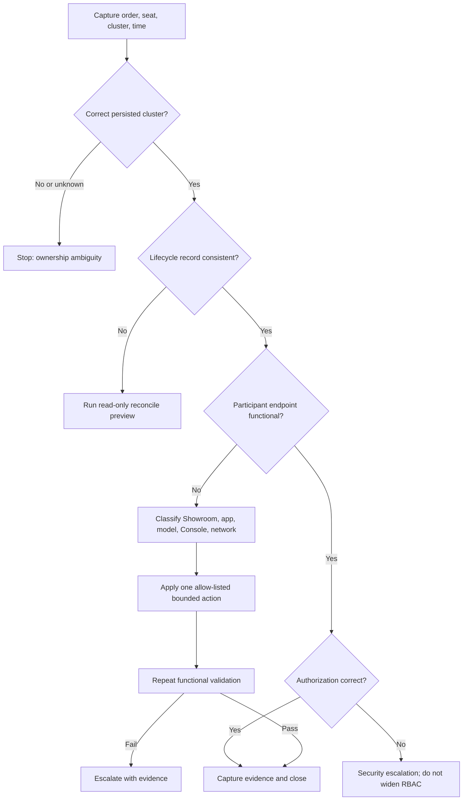

# Launchpad support runbook

## Scope

This runbook supports requester, workshop, participant, provisioning,
Showroom, model, Console, and reclaim incidents for the supervised internal
pilot. It does not authorize cluster-level repair, credential disclosure,
manual namespace deletion, or bypassing admission policy.

## Start with correlation, not symptoms

Collect these identifiers before changing anything:

- requester and tenant ID;
- catalog ID and immutable version;
- workshop/order ID and seat/session ID;
- persisted `cluster_ref` and namespace;
- lifecycle state and last event timestamp;
- public/internal exposure policy;
- browser timestamp, error text, and request ID;
- evidence run ID when the incident occurred during certification.

Never paste instructor codes, participant tokens, API keys, kubeconfigs,
passwords, Secret values, or raw authentication callbacks into a ticket.

## Severity

| Severity | Definition | Initial response |
|---|---|---|
| SEV-1 | Cross-tenant access, credential disclosure, destructive fleet mutation, or complete event outage | Stop new orders, preserve evidence, page security/platform owners |
| SEV-2 | One workshop unavailable, cleanup unable to contain owned resources, or shared model/ingress failure | Disable affected placement/catalog, preserve working workshops |
| SEV-3 | One seat, route, Console, content, or model journey fails | Classify and use bounded session-scoped recovery |
| SEV-4 | Cosmetic, documentation, or non-blocking observability issue | Record for normal triage |

## Triage flow

## Common failure classes

| Failure | Check | Safe action | Escalate when |
|---|---|---|---|
| No eligible cluster | Admin preflight, capability/model requirement, whole-order capacity | Correct catalog/cluster facts or wait for capacity; never force placement | Health or capacity data is wrong or all certified targets are ineligible |
| Stuck provisioning | Lifecycle job, Argo sync, pod events, image pulls, route readiness | One bounded failed-seat retry on the same cluster | Retry budget exhausted or shared dependency failed |
| Showroom missing/wrong | Catalog SHA, playbook/start path, Application, Route response | Resync the owned Application; fix source for future orders | Content revision is mutable or another catalog appears |
| Terminal reconnect loop | WebSocket route, pod/container readiness, namespace attributes | Reconcile owned Route or restart the managed terminal within budget | Ingress/shared image or identity is at fault |
| Console loops/404 | Cluster Console/OAuth URL, OIDC callback, participant RBAC | Mark Console gate RED; use terminal only as a documented fallback | Identity mapping or cross-namespace boundary is wrong |
| Model call fails | Required model inventory, endpoint reachability, inference-aware readiness | Wait/retry within documented warmup budget | Model unavailable beyond budget or wrong model is substituted |
| Reclaim failed | Workshop job, persisted cluster, owned labels/finalizers | Retry Launchpad group reclaim on the same cluster | Ownership is ambiguous, cluster unreachable, or unlabeled resources remain |
| Stale record | Compare lifecycle record with labeled resources on persisted cluster | Reconcile the record only after absence is proven | Any owned resource still exists |

## Reclaim rules

Use the requester/admin workshop reclaim action or the authenticated Launchpad
API. Do not start with `oc delete namespace`. Reclaim must:

1. stop new seat creation for the order;
2. revoke participant and model access;
3. delete seat-owned Routes, RoleBindings, workloads, storage, and Applications;
4. remove namespaces from the persisted execution cluster;
5. mark every seat and the workshop terminal;
6. release the aggregate capacity reservation;
7. verify zero labeled residue.

Repeating reclaim must be safe. A different cluster is never an acceptable
cleanup fallback.

## Evidence bundle

Attach a sanitized bundle containing commit SHA, image digests, catalog
version, order/session IDs, cluster ID, timestamps, lifecycle events, capacity
preview, readiness/function probes, audit references, cleanup counts, and
artifact hashes. Browser defects should also include a screenshot, Console
errors, and the failing URL with query secrets removed.

## Event-day roles

- **Presenter/instructor:** owns timing, participant communication, and the
  decision to use recorded evidence.
- **Launchpad operator:** owns admission, lifecycle, cluster eligibility,
  bounded retry, reclaim, and evidence.
- **Cluster owner:** owns nodes, storage, ingress, Operators, and certificates.
- **Model owner:** owns endpoint readiness, capacity, and model/version truth.
- **Security/identity owner:** owns OAuth/Keycloak, trust, and incident response.
- **Content integrator:** owns Showroom instructions and catalog-specific probes.

One person may hold multiple pilot roles, but every action must still be
attributed.

## Handoff and post-event

After an event, bulk reclaim every workshop, verify zero residue on each
persisted target, archive evidence, record failures as regression tests, and
publish measured provisioning/readiness/reclaim percentiles. Do not promote a
catalog or raise its seat ceiling from anecdotal success.
